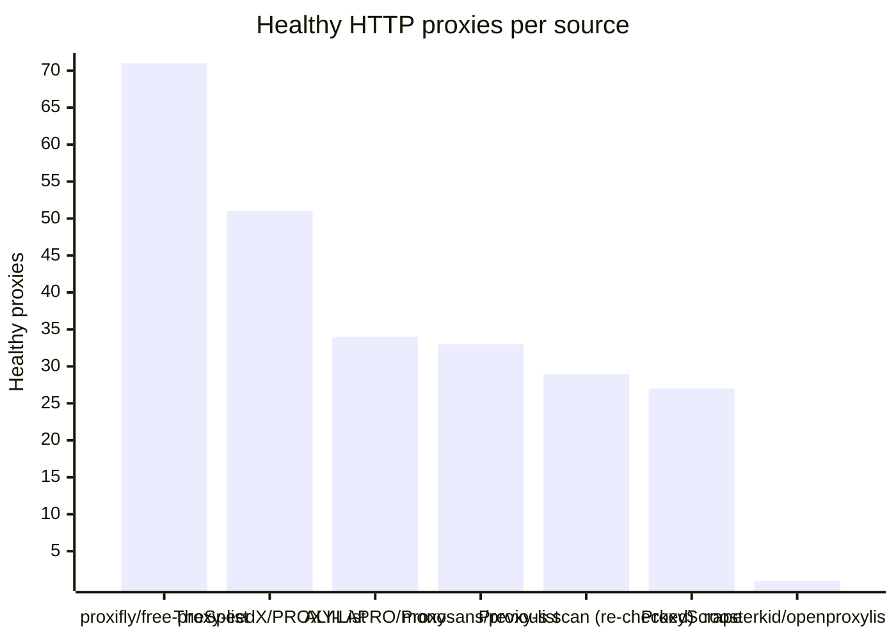
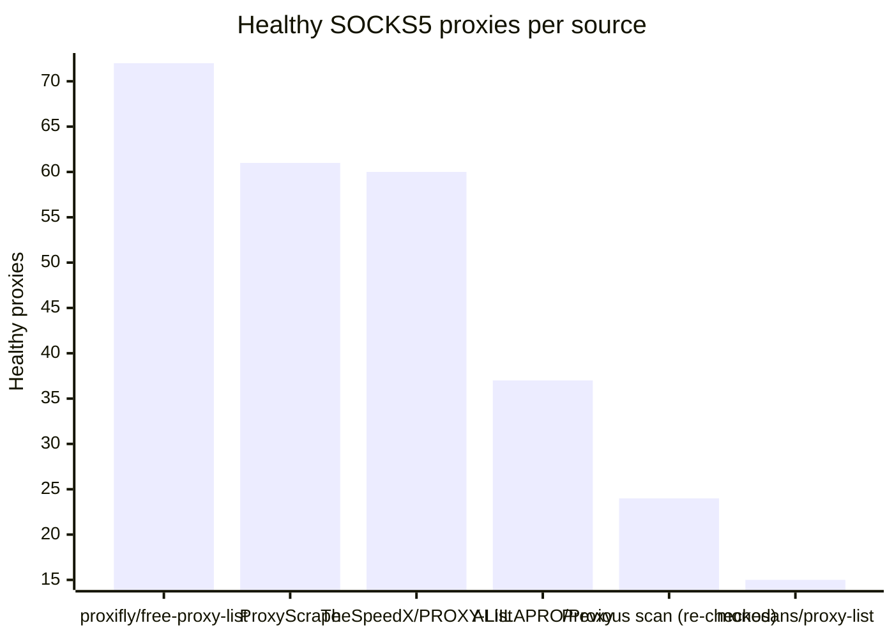

# Proxy Configs

<!-- dynamic timestamp placeholders for workflow sed script -->
channel_stats_chart.svg?v=1791309724
performance_report.html?v=1791309724

### Performance Chart

### Performance Report
[View Report](assets/performance_report.html?v=1791309724)

## HTTP

<!-- STATS:HTTP:START -->

_Last updated: 2026-10-30 12:13 UTC_

```mermaid
xychart-beta
    title "Healthy HTTP proxies per source"
    x-axis ["proxifly/free-proxy-list", "TheSpeedX/PROXY-List", "ALIILAPRO/Proxy", "monosans/proxy-list", "Previous scan (re-checked)", "ProxyScrape", "roosterkid/openproxylist"]
    y-axis "Healthy proxies"
    bar [71, 51, 34, 33, 29, 27, 1]
```

| Source | Healthy proxies |
|---|---|
| proxifly/free-proxy-list | 71 |
| TheSpeedX/PROXY-List | 51 |
| ALIILAPRO/Proxy | 34 |
| monosans/proxy-list | 33 |
| Previous scan (re-checked) | 29 |
| ProxyScrape | 27 |
| roosterkid/openproxylist | 1 |
| **Total unique** | **246** |

<!-- STATS:HTTP:END -->

## SOCKS5

<!-- STATS:SOCKS5:START -->

_Last updated: 2026-10-30 12:13 UTC_

```mermaid
xychart-beta
    title "Healthy SOCKS5 proxies per source"
    x-axis ["proxifly/free-proxy-list", "ProxyScrape", "TheSpeedX/PROXY-List", "ALIILAPRO/Proxy", "Previous scan (re-checked)", "monosans/proxy-list"]
    y-axis "Healthy proxies"
    bar [72, 61, 60, 37, 24, 15]
```

| Source | Healthy proxies |
|---|---|
| proxifly/free-proxy-list | 72 |
| ProxyScrape | 61 |
| TheSpeedX/PROXY-List | 60 |
| ALIILAPRO/Proxy | 37 |
| Previous scan (re-checked) | 24 |
| monosans/proxy-list | 15 |
| **Total unique** | **269** |

<!-- STATS:SOCKS5:END -->
