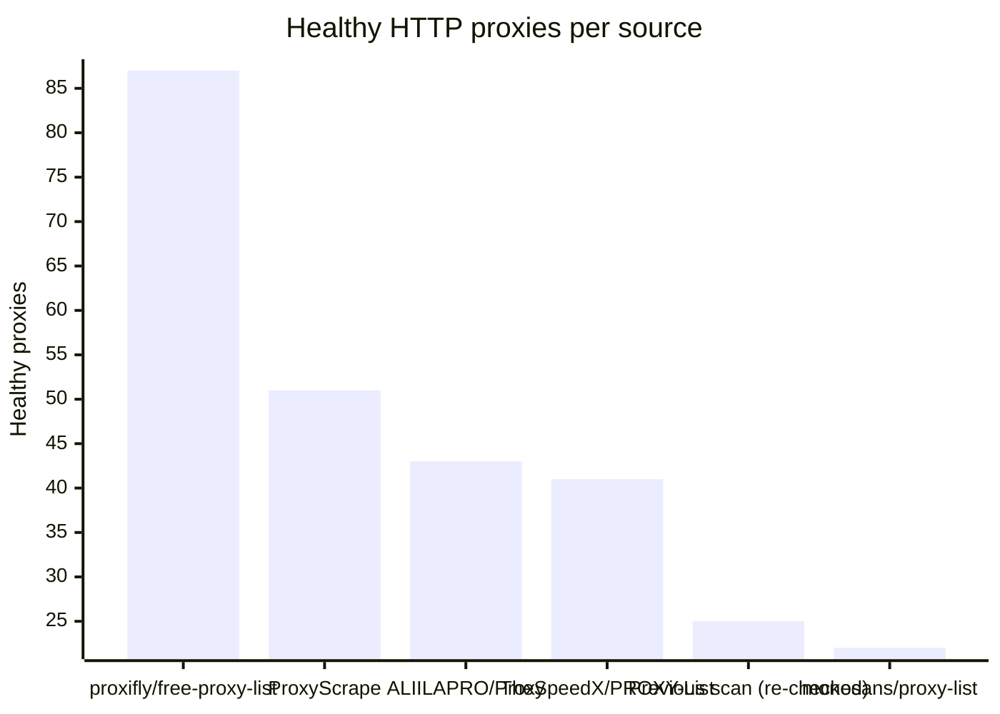
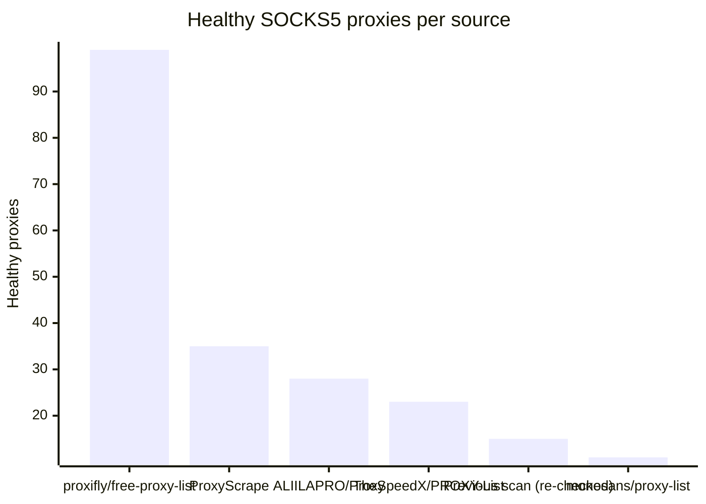

# Proxy Configs

<!-- dynamic timestamp placeholders for workflow sed script -->
channel_stats_chart.svg?v=1791309724
performance_report.html?v=1791309724

### Performance Chart

### Performance Report
[View Report](assets/performance_report.html?v=1791309724)

## HTTP

<!-- STATS:HTTP:START -->

_Last updated: 2026-10-27 06:23 UTC_

```mermaid
xychart-beta
    title "Healthy HTTP proxies per source"
    x-axis ["proxifly/free-proxy-list", "ProxyScrape", "ALIILAPRO/Proxy", "TheSpeedX/PROXY-List", "Previous scan (re-checked)", "monosans/proxy-list"]
    y-axis "Healthy proxies"
    bar [87, 51, 43, 41, 25, 22]
```

| Source | Healthy proxies |
|---|---|
| proxifly/free-proxy-list | 87 |
| ProxyScrape | 51 |
| ALIILAPRO/Proxy | 43 |
| TheSpeedX/PROXY-List | 41 |
| Previous scan (re-checked) | 25 |
| monosans/proxy-list | 22 |
| **Total unique** | **269** |

<!-- STATS:HTTP:END -->

## SOCKS5

<!-- STATS:SOCKS5:START -->

_Last updated: 2026-10-27 06:23 UTC_

```mermaid
xychart-beta
    title "Healthy SOCKS5 proxies per source"
    x-axis ["proxifly/free-proxy-list", "ProxyScrape", "ALIILAPRO/Proxy", "TheSpeedX/PROXY-List", "Previous scan (re-checked)", "monosans/proxy-list"]
    y-axis "Healthy proxies"
    bar [99, 35, 28, 23, 15, 11]
```

| Source | Healthy proxies |
|---|---|
| proxifly/free-proxy-list | 99 |
| ProxyScrape | 35 |
| ALIILAPRO/Proxy | 28 |
| TheSpeedX/PROXY-List | 23 |
| Previous scan (re-checked) | 15 |
| monosans/proxy-list | 11 |
| **Total unique** | **211** |

<!-- STATS:SOCKS5:END -->
