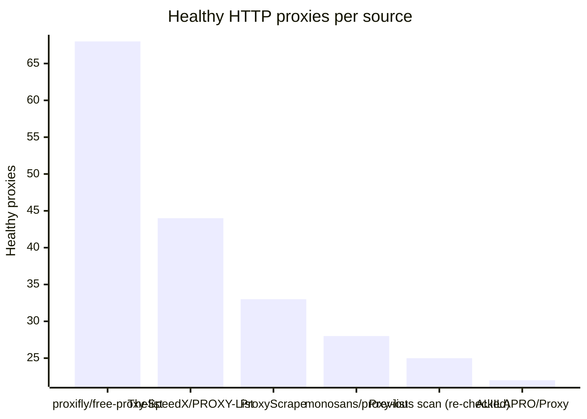
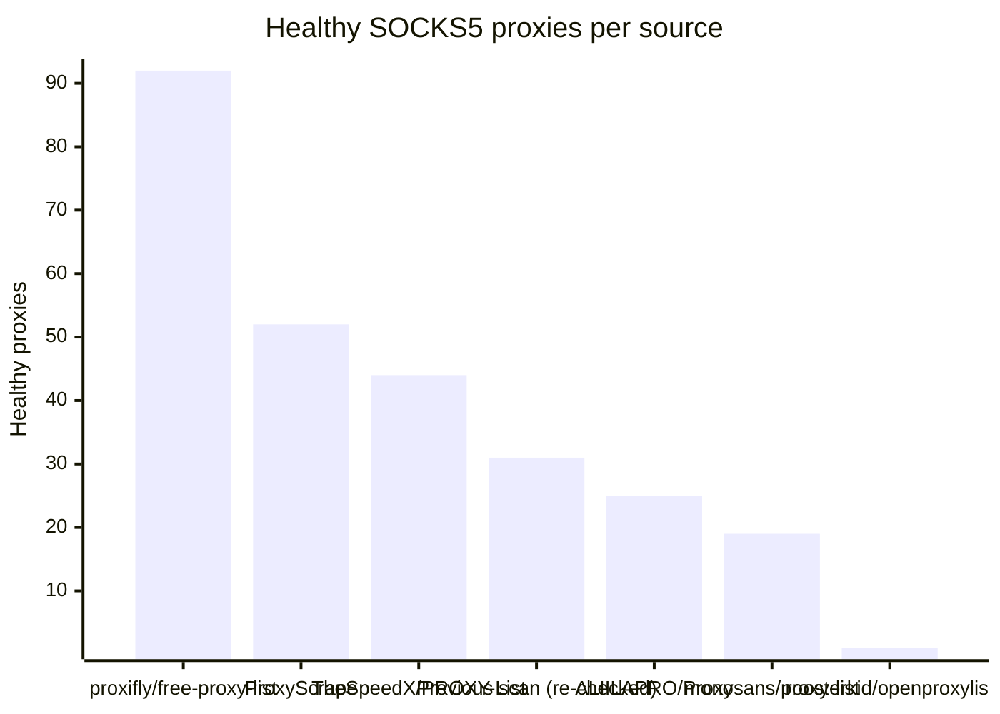

# Proxy Configs

<!-- dynamic timestamp placeholders for workflow sed script -->
channel_stats_chart.svg?v=1791828218
performance_report.html?v=1791828218

### Performance Chart

### Performance Report
[View Report](assets/performance_report.html?v=1791828218)

## HTTP

<!-- STATS:HTTP:START -->

_Last updated: 2026-10-12 12:22 UTC_

```mermaid
xychart-beta
    title "Healthy HTTP proxies per source"
    x-axis ["proxifly/free-proxy-list", "TheSpeedX/PROXY-List", "ProxyScrape", "monosans/proxy-list", "Previous scan (re-checked)", "ALIILAPRO/Proxy"]
    y-axis "Healthy proxies"
    bar [68, 44, 33, 28, 25, 22]
```

| Source | Healthy proxies |
|---|---|
| proxifly/free-proxy-list | 68 |
| TheSpeedX/PROXY-List | 44 |
| ProxyScrape | 33 |
| monosans/proxy-list | 28 |
| Previous scan (re-checked) | 25 |
| ALIILAPRO/Proxy | 22 |
| **Total unique** | **220** |

<!-- STATS:HTTP:END -->

## SOCKS5

<!-- STATS:SOCKS5:START -->

_Last updated: 2026-10-12 12:22 UTC_

```mermaid
xychart-beta
    title "Healthy SOCKS5 proxies per source"
    x-axis ["proxifly/free-proxy-list", "ProxyScrape", "TheSpeedX/PROXY-List", "Previous scan (re-checked)", "ALIILAPRO/Proxy", "monosans/proxy-list", "roosterkid/openproxylist"]
    y-axis "Healthy proxies"
    bar [92, 52, 44, 31, 25, 19, 1]
```

| Source | Healthy proxies |
|---|---|
| proxifly/free-proxy-list | 92 |
| ProxyScrape | 52 |
| TheSpeedX/PROXY-List | 44 |
| Previous scan (re-checked) | 31 |
| ALIILAPRO/Proxy | 25 |
| monosans/proxy-list | 19 |
| roosterkid/openproxylist | 1 |
| **Total unique** | **264** |

<!-- STATS:SOCKS5:END -->
