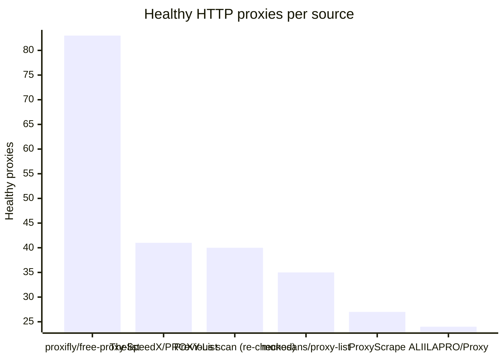
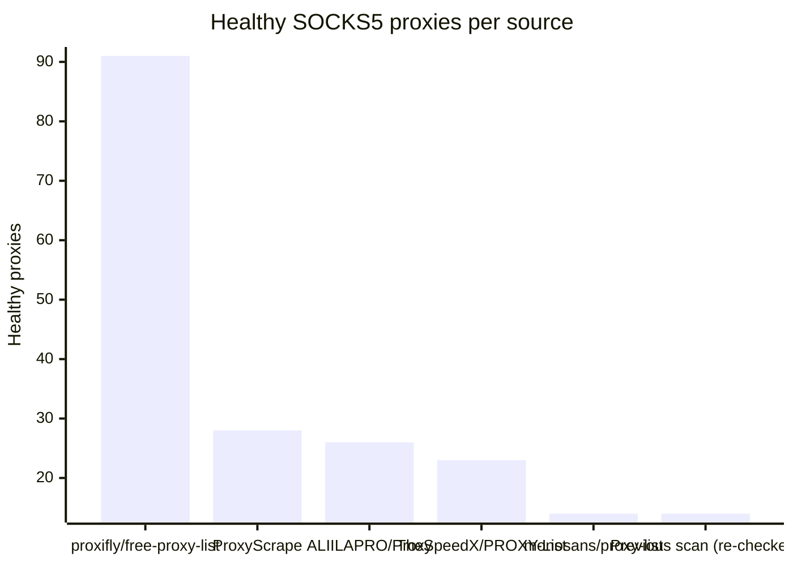

# Proxy Configs

<!-- dynamic timestamp placeholders for workflow sed script -->
channel_stats_chart.svg?v=1791309724
performance_report.html?v=1791309724

### Performance Chart

### Performance Report
[View Report](assets/performance_report.html?v=1791309724)

## HTTP

<!-- STATS:HTTP:START -->

_Last updated: 2026-10-15 18:24 UTC_

```mermaid
xychart-beta
    title "Healthy HTTP proxies per source"
    x-axis ["proxifly/free-proxy-list", "TheSpeedX/PROXY-List", "Previous scan (re-checked)", "monosans/proxy-list", "ProxyScrape", "ALIILAPRO/Proxy"]
    y-axis "Healthy proxies"
    bar [83, 41, 40, 35, 27, 24]
```

| Source | Healthy proxies |
|---|---|
| proxifly/free-proxy-list | 83 |
| TheSpeedX/PROXY-List | 41 |
| Previous scan (re-checked) | 40 |
| monosans/proxy-list | 35 |
| ProxyScrape | 27 |
| ALIILAPRO/Proxy | 24 |
| **Total unique** | **250** |

<!-- STATS:HTTP:END -->

## SOCKS5

<!-- STATS:SOCKS5:START -->

_Last updated: 2026-10-15 18:24 UTC_

```mermaid
xychart-beta
    title "Healthy SOCKS5 proxies per source"
    x-axis ["proxifly/free-proxy-list", "ProxyScrape", "ALIILAPRO/Proxy", "TheSpeedX/PROXY-List", "monosans/proxy-list", "Previous scan (re-checked)"]
    y-axis "Healthy proxies"
    bar [91, 28, 26, 23, 14, 14]
```

| Source | Healthy proxies |
|---|---|
| proxifly/free-proxy-list | 91 |
| ProxyScrape | 28 |
| ALIILAPRO/Proxy | 26 |
| TheSpeedX/PROXY-List | 23 |
| monosans/proxy-list | 14 |
| Previous scan (re-checked) | 14 |
| **Total unique** | **196** |

<!-- STATS:SOCKS5:END -->
