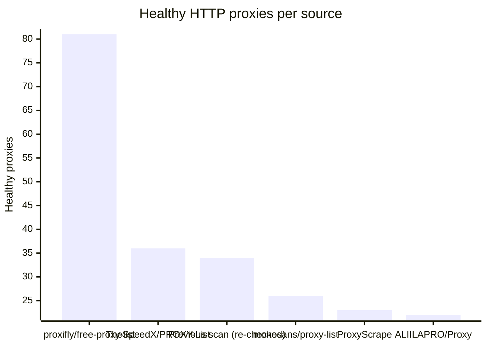
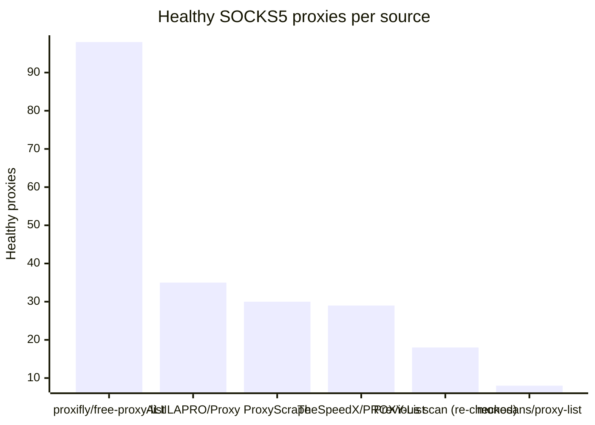

# Proxy Configs

<!-- dynamic timestamp placeholders for workflow sed script -->
channel_stats_chart.svg?v=1791309724
performance_report.html?v=1791309724

### Performance Chart

### Performance Report
[View Report](assets/performance_report.html?v=1791309724)

## HTTP

<!-- STATS:HTTP:START -->

_Last updated: 2026-10-30 00:22 UTC_

```mermaid
xychart-beta
    title "Healthy HTTP proxies per source"
    x-axis ["proxifly/free-proxy-list", "TheSpeedX/PROXY-List", "Previous scan (re-checked)", "monosans/proxy-list", "ProxyScrape", "ALIILAPRO/Proxy"]
    y-axis "Healthy proxies"
    bar [81, 36, 34, 26, 23, 22]
```

| Source | Healthy proxies |
|---|---|
| proxifly/free-proxy-list | 81 |
| TheSpeedX/PROXY-List | 36 |
| Previous scan (re-checked) | 34 |
| monosans/proxy-list | 26 |
| ProxyScrape | 23 |
| ALIILAPRO/Proxy | 22 |
| **Total unique** | **222** |

<!-- STATS:HTTP:END -->

## SOCKS5

<!-- STATS:SOCKS5:START -->

_Last updated: 2026-10-30 00:22 UTC_

```mermaid
xychart-beta
    title "Healthy SOCKS5 proxies per source"
    x-axis ["proxifly/free-proxy-list", "ALIILAPRO/Proxy", "ProxyScrape", "TheSpeedX/PROXY-List", "Previous scan (re-checked)", "monosans/proxy-list"]
    y-axis "Healthy proxies"
    bar [98, 35, 30, 29, 18, 8]
```

| Source | Healthy proxies |
|---|---|
| proxifly/free-proxy-list | 98 |
| ALIILAPRO/Proxy | 35 |
| ProxyScrape | 30 |
| TheSpeedX/PROXY-List | 29 |
| Previous scan (re-checked) | 18 |
| monosans/proxy-list | 8 |
| **Total unique** | **218** |

<!-- STATS:SOCKS5:END -->
