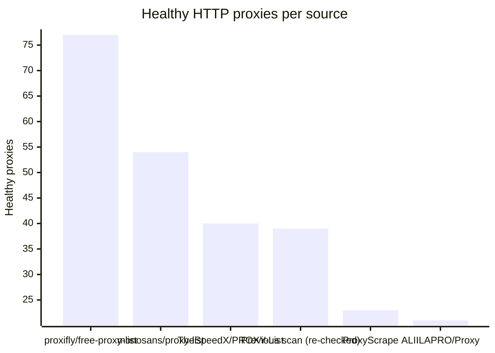
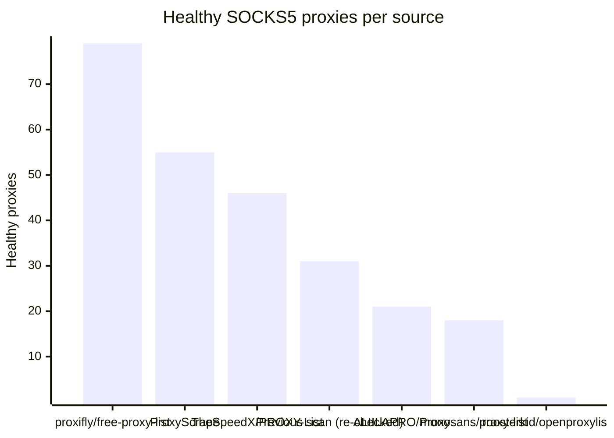

# Proxy Configs

<!-- dynamic timestamp placeholders for workflow sed script -->
channel_stats_chart.svg?v=1791309724
performance_report.html?v=1791309724

### Performance Chart

### Performance Report
[View Report](assets/performance_report.html?v=1791309724)

## HTTP

<!-- STATS:HTTP:START -->

_Last updated: 2026-11-08 06:17 UTC_

```mermaid
xychart-beta
    title "Healthy HTTP proxies per source"
    x-axis ["proxifly/free-proxy-list", "monosans/proxy-list", "TheSpeedX/PROXY-List", "Previous scan (re-checked)", "ProxyScrape", "ALIILAPRO/Proxy"]
    y-axis "Healthy proxies"
    bar [77, 54, 40, 39, 23, 21]
```

| Source | Healthy proxies |
|---|---|
| proxifly/free-proxy-list | 77 |
| monosans/proxy-list | 54 |
| TheSpeedX/PROXY-List | 40 |
| Previous scan (re-checked) | 39 |
| ProxyScrape | 23 |
| ALIILAPRO/Proxy | 21 |
| **Total unique** | **254** |

<!-- STATS:HTTP:END -->

## SOCKS5

<!-- STATS:SOCKS5:START -->

_Last updated: 2026-11-08 06:17 UTC_

```mermaid
xychart-beta
    title "Healthy SOCKS5 proxies per source"
    x-axis ["proxifly/free-proxy-list", "ProxyScrape", "TheSpeedX/PROXY-List", "Previous scan (re-checked)", "ALIILAPRO/Proxy", "monosans/proxy-list", "roosterkid/openproxylist"]
    y-axis "Healthy proxies"
    bar [79, 55, 46, 31, 21, 18, 1]
```

| Source | Healthy proxies |
|---|---|
| proxifly/free-proxy-list | 79 |
| ProxyScrape | 55 |
| TheSpeedX/PROXY-List | 46 |
| Previous scan (re-checked) | 31 |
| ALIILAPRO/Proxy | 21 |
| monosans/proxy-list | 18 |
| roosterkid/openproxylist | 1 |
| **Total unique** | **251** |

<!-- STATS:SOCKS5:END -->
