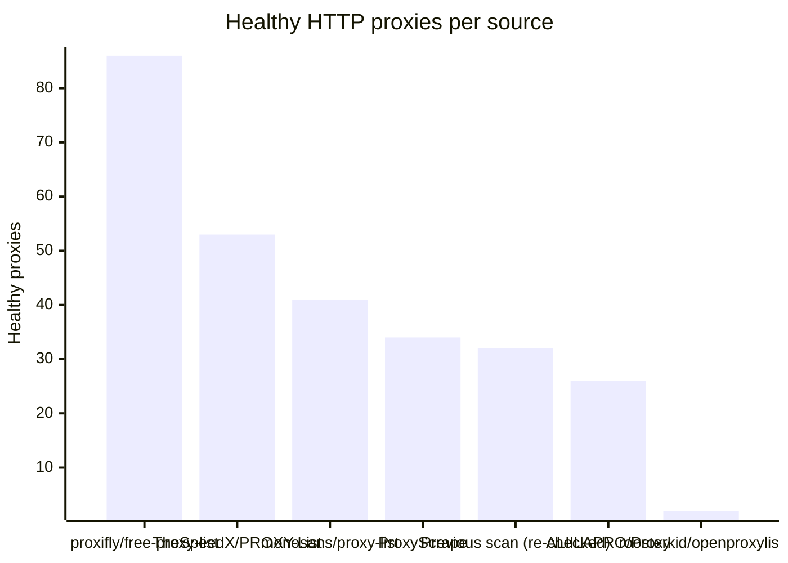
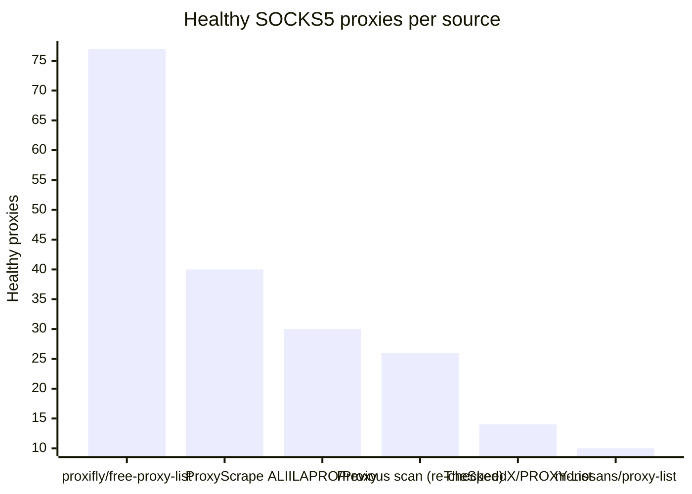

# Proxy Configs

<!-- dynamic timestamp placeholders for workflow sed script -->
channel_stats_chart.svg?v=1791309724
performance_report.html?v=1791309724

### Performance Chart

### Performance Report
[View Report](assets/performance_report.html?v=1791309724)

## HTTP

<!-- STATS:HTTP:START -->

_Last updated: 2026-11-07 18:15 UTC_

```mermaid
xychart-beta
    title "Healthy HTTP proxies per source"
    x-axis ["proxifly/free-proxy-list", "TheSpeedX/PROXY-List", "monosans/proxy-list", "ProxyScrape", "Previous scan (re-checked)", "ALIILAPRO/Proxy", "roosterkid/openproxylist"]
    y-axis "Healthy proxies"
    bar [86, 53, 41, 34, 32, 26, 2]
```

| Source | Healthy proxies |
|---|---|
| proxifly/free-proxy-list | 86 |
| TheSpeedX/PROXY-List | 53 |
| monosans/proxy-list | 41 |
| ProxyScrape | 34 |
| Previous scan (re-checked) | 32 |
| ALIILAPRO/Proxy | 26 |
| roosterkid/openproxylist | 2 |
| **Total unique** | **274** |

<!-- STATS:HTTP:END -->

## SOCKS5

<!-- STATS:SOCKS5:START -->

_Last updated: 2026-11-07 18:15 UTC_

```mermaid
xychart-beta
    title "Healthy SOCKS5 proxies per source"
    x-axis ["proxifly/free-proxy-list", "ProxyScrape", "ALIILAPRO/Proxy", "Previous scan (re-checked)", "TheSpeedX/PROXY-List", "monosans/proxy-list"]
    y-axis "Healthy proxies"
    bar [77, 40, 30, 26, 14, 10]
```

| Source | Healthy proxies |
|---|---|
| proxifly/free-proxy-list | 77 |
| ProxyScrape | 40 |
| ALIILAPRO/Proxy | 30 |
| Previous scan (re-checked) | 26 |
| TheSpeedX/PROXY-List | 14 |
| monosans/proxy-list | 10 |
| **Total unique** | **197** |

<!-- STATS:SOCKS5:END -->
