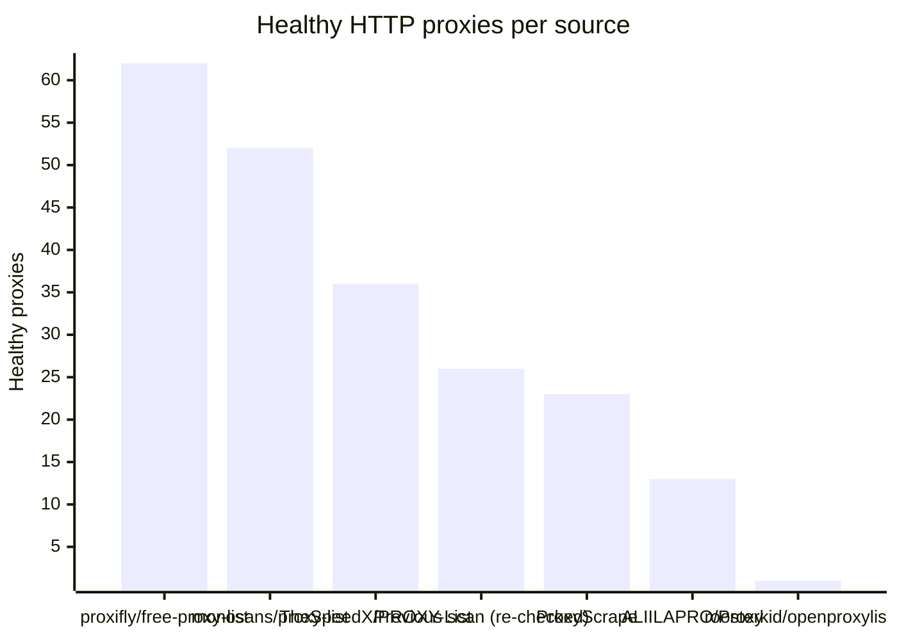
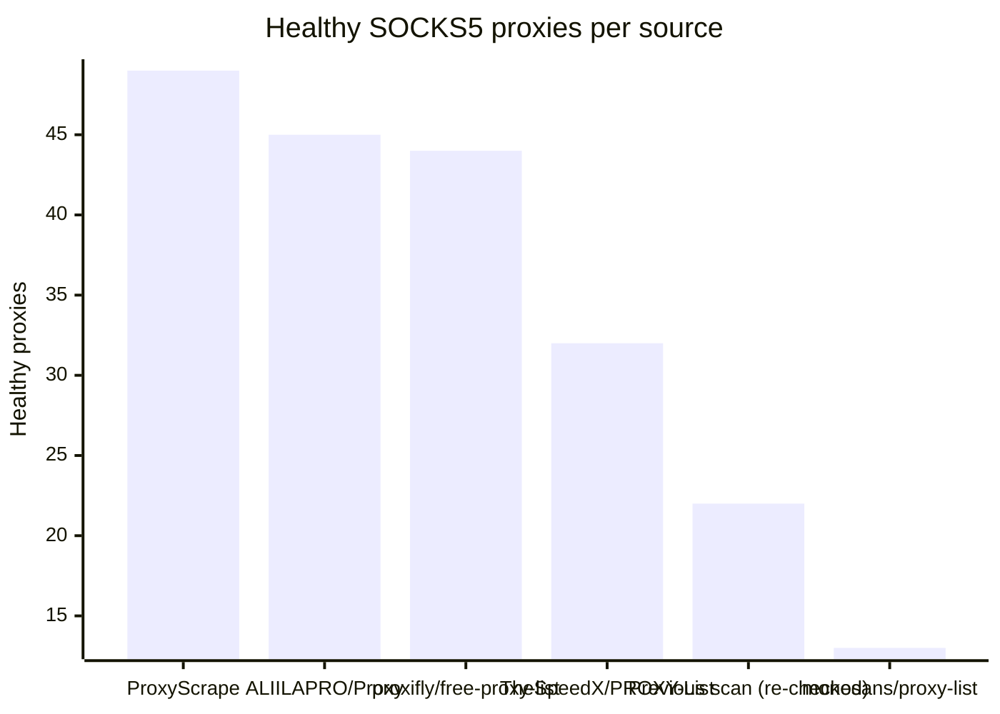

# Proxy Configs

<!-- dynamic timestamp placeholders for workflow sed script -->
channel_stats_chart.svg?v=1791309724
performance_report.html?v=1791309724

### Performance Chart

### Performance Report
[View Report](assets/performance_report.html?v=1791309724)

## HTTP

<!-- STATS:HTTP:START -->

_Last updated: 2026-11-01 18:16 UTC_

```mermaid
xychart-beta
    title "Healthy HTTP proxies per source"
    x-axis ["proxifly/free-proxy-list", "monosans/proxy-list", "TheSpeedX/PROXY-List", "Previous scan (re-checked)", "ProxyScrape", "ALIILAPRO/Proxy", "roosterkid/openproxylist"]
    y-axis "Healthy proxies"
    bar [62, 52, 36, 26, 23, 13, 1]
```

| Source | Healthy proxies |
|---|---|
| proxifly/free-proxy-list | 62 |
| monosans/proxy-list | 52 |
| TheSpeedX/PROXY-List | 36 |
| Previous scan (re-checked) | 26 |
| ProxyScrape | 23 |
| ALIILAPRO/Proxy | 13 |
| roosterkid/openproxylist | 1 |
| **Total unique** | **213** |

<!-- STATS:HTTP:END -->

## SOCKS5

<!-- STATS:SOCKS5:START -->

_Last updated: 2026-11-01 18:16 UTC_

```mermaid
xychart-beta
    title "Healthy SOCKS5 proxies per source"
    x-axis ["ProxyScrape", "ALIILAPRO/Proxy", "proxifly/free-proxy-list", "TheSpeedX/PROXY-List", "Previous scan (re-checked)", "monosans/proxy-list"]
    y-axis "Healthy proxies"
    bar [49, 45, 44, 32, 22, 13]
```

| Source | Healthy proxies |
|---|---|
| ProxyScrape | 49 |
| ALIILAPRO/Proxy | 45 |
| proxifly/free-proxy-list | 44 |
| TheSpeedX/PROXY-List | 32 |
| Previous scan (re-checked) | 22 |
| monosans/proxy-list | 13 |
| **Total unique** | **205** |

<!-- STATS:SOCKS5:END -->
