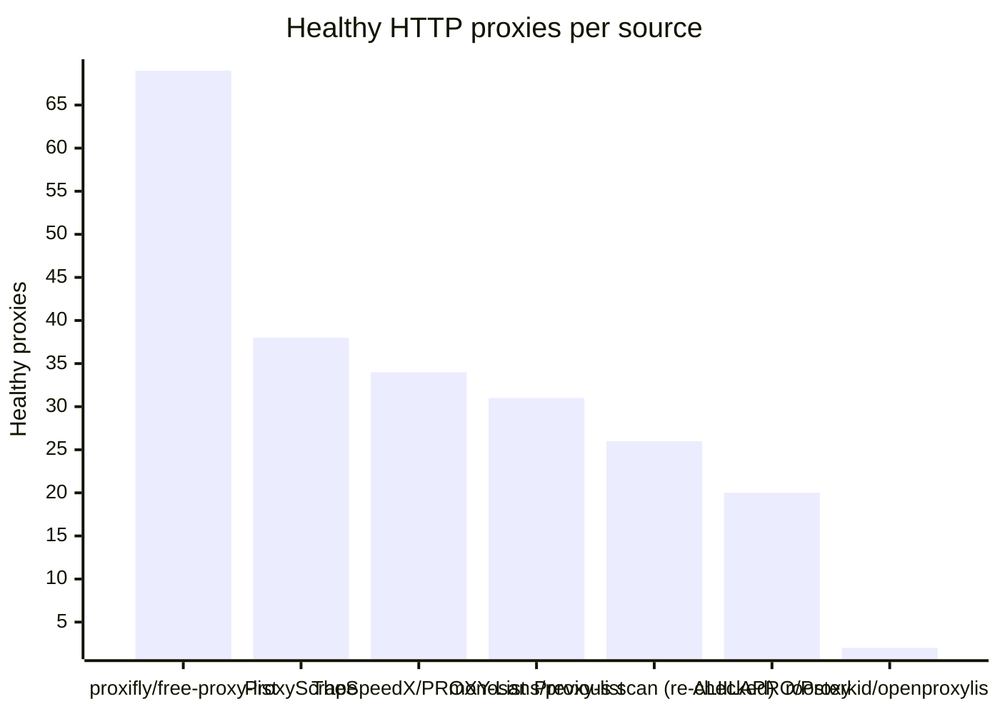
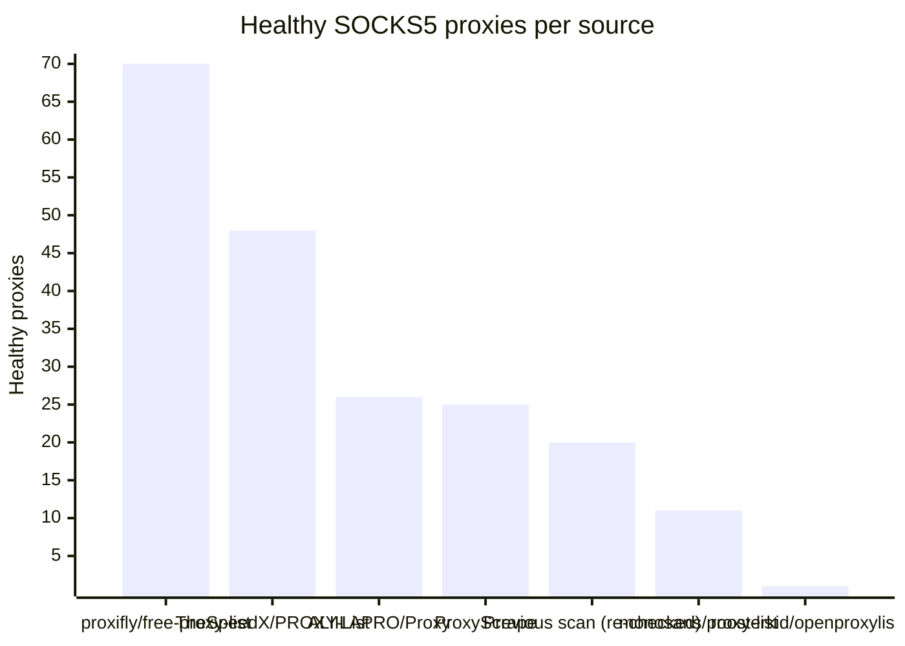

# Proxy Configs

<!-- dynamic timestamp placeholders for workflow sed script -->
channel_stats_chart.svg?v=1791309724
performance_report.html?v=1791309724

### Performance Chart

### Performance Report
[View Report](assets/performance_report.html?v=1791309724)

## HTTP

<!-- STATS:HTTP:START -->

_Last updated: 2026-11-09 00:16 UTC_

```mermaid
xychart-beta
    title "Healthy HTTP proxies per source"
    x-axis ["proxifly/free-proxy-list", "ProxyScrape", "TheSpeedX/PROXY-List", "monosans/proxy-list", "Previous scan (re-checked)", "ALIILAPRO/Proxy", "roosterkid/openproxylist"]
    y-axis "Healthy proxies"
    bar [69, 38, 34, 31, 26, 20, 2]
```

| Source | Healthy proxies |
|---|---|
| proxifly/free-proxy-list | 69 |
| ProxyScrape | 38 |
| TheSpeedX/PROXY-List | 34 |
| monosans/proxy-list | 31 |
| Previous scan (re-checked) | 26 |
| ALIILAPRO/Proxy | 20 |
| roosterkid/openproxylist | 2 |
| **Total unique** | **220** |

<!-- STATS:HTTP:END -->

## SOCKS5

<!-- STATS:SOCKS5:START -->

_Last updated: 2026-11-09 00:16 UTC_

```mermaid
xychart-beta
    title "Healthy SOCKS5 proxies per source"
    x-axis ["proxifly/free-proxy-list", "TheSpeedX/PROXY-List", "ALIILAPRO/Proxy", "ProxyScrape", "Previous scan (re-checked)", "monosans/proxy-list", "roosterkid/openproxylist"]
    y-axis "Healthy proxies"
    bar [70, 48, 26, 25, 20, 11, 1]
```

| Source | Healthy proxies |
|---|---|
| proxifly/free-proxy-list | 70 |
| TheSpeedX/PROXY-List | 48 |
| ALIILAPRO/Proxy | 26 |
| ProxyScrape | 25 |
| Previous scan (re-checked) | 20 |
| monosans/proxy-list | 11 |
| roosterkid/openproxylist | 1 |
| **Total unique** | **201** |

<!-- STATS:SOCKS5:END -->
