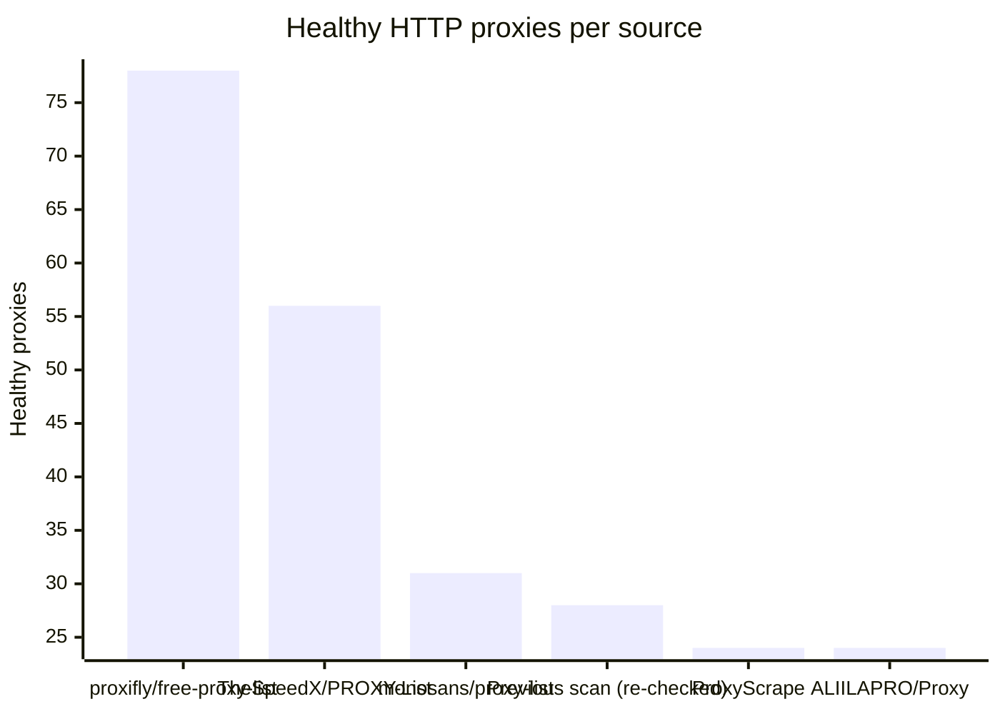
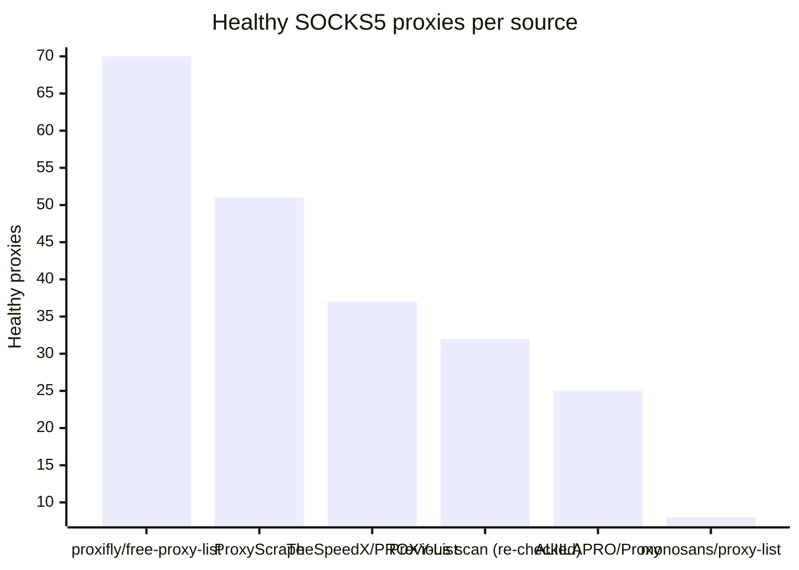

# Proxy Configs

<!-- dynamic timestamp placeholders for workflow sed script -->
channel_stats_chart.svg?v=1791309724
performance_report.html?v=1791309724

### Performance Chart

### Performance Report
[View Report](assets/performance_report.html?v=1791309724)

## HTTP

<!-- STATS:HTTP:START -->

_Last updated: 2026-11-14 06:16 UTC_

```mermaid
xychart-beta
    title "Healthy HTTP proxies per source"
    x-axis ["proxifly/free-proxy-list", "TheSpeedX/PROXY-List", "monosans/proxy-list", "Previous scan (re-checked)", "ProxyScrape", "ALIILAPRO/Proxy"]
    y-axis "Healthy proxies"
    bar [78, 56, 31, 28, 24, 24]
```

| Source | Healthy proxies |
|---|---|
| proxifly/free-proxy-list | 78 |
| TheSpeedX/PROXY-List | 56 |
| monosans/proxy-list | 31 |
| Previous scan (re-checked) | 28 |
| ProxyScrape | 24 |
| ALIILAPRO/Proxy | 24 |
| **Total unique** | **241** |

<!-- STATS:HTTP:END -->

## SOCKS5

<!-- STATS:SOCKS5:START -->

_Last updated: 2026-11-14 06:16 UTC_

```mermaid
xychart-beta
    title "Healthy SOCKS5 proxies per source"
    x-axis ["proxifly/free-proxy-list", "ProxyScrape", "TheSpeedX/PROXY-List", "Previous scan (re-checked)", "ALIILAPRO/Proxy", "monosans/proxy-list"]
    y-axis "Healthy proxies"
    bar [70, 51, 37, 32, 25, 8]
```

| Source | Healthy proxies |
|---|---|
| proxifly/free-proxy-list | 70 |
| ProxyScrape | 51 |
| TheSpeedX/PROXY-List | 37 |
| Previous scan (re-checked) | 32 |
| ALIILAPRO/Proxy | 25 |
| monosans/proxy-list | 8 |
| **Total unique** | **223** |

<!-- STATS:SOCKS5:END -->
