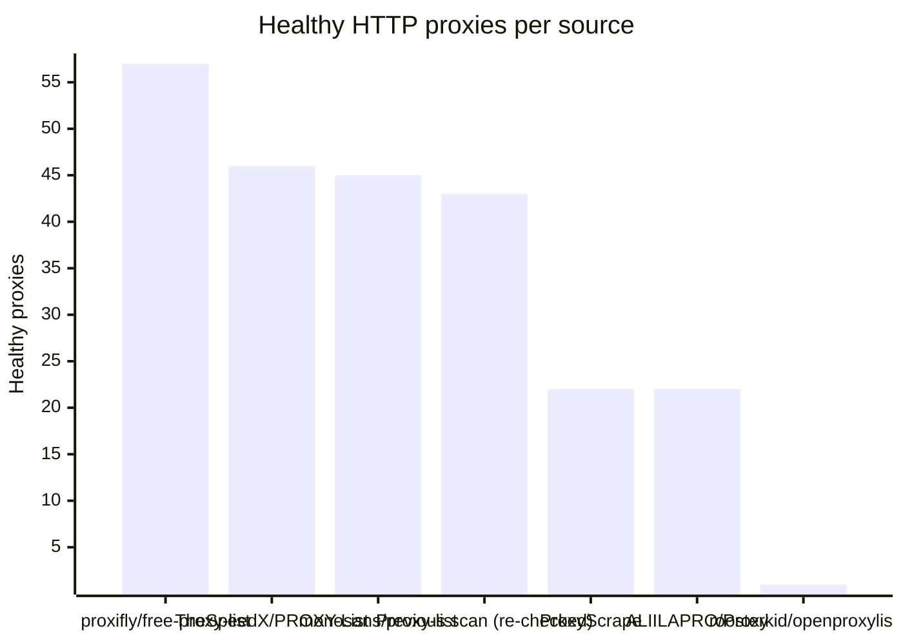
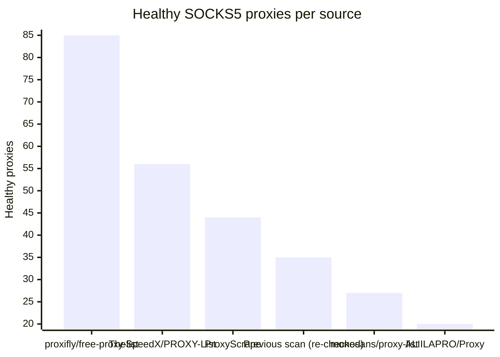

# Proxy Configs

<!-- dynamic timestamp placeholders for workflow sed script -->
channel_stats_chart.svg?v=1791309724
performance_report.html?v=1791309724

### Performance Chart

### Performance Report
[View Report](assets/performance_report.html?v=1791309724)

## HTTP

<!-- STATS:HTTP:START -->

_Last updated: 2026-11-04 12:17 UTC_

```mermaid
xychart-beta
    title "Healthy HTTP proxies per source"
    x-axis ["proxifly/free-proxy-list", "TheSpeedX/PROXY-List", "monosans/proxy-list", "Previous scan (re-checked)", "ProxyScrape", "ALIILAPRO/Proxy", "roosterkid/openproxylist"]
    y-axis "Healthy proxies"
    bar [57, 46, 45, 43, 22, 22, 1]
```

| Source | Healthy proxies |
|---|---|
| proxifly/free-proxy-list | 57 |
| TheSpeedX/PROXY-List | 46 |
| monosans/proxy-list | 45 |
| Previous scan (re-checked) | 43 |
| ProxyScrape | 22 |
| ALIILAPRO/Proxy | 22 |
| roosterkid/openproxylist | 1 |
| **Total unique** | **236** |

<!-- STATS:HTTP:END -->

## SOCKS5

<!-- STATS:SOCKS5:START -->

_Last updated: 2026-11-04 12:17 UTC_

```mermaid
xychart-beta
    title "Healthy SOCKS5 proxies per source"
    x-axis ["proxifly/free-proxy-list", "TheSpeedX/PROXY-List", "ProxyScrape", "Previous scan (re-checked)", "monosans/proxy-list", "ALIILAPRO/Proxy"]
    y-axis "Healthy proxies"
    bar [85, 56, 44, 35, 27, 20]
```

| Source | Healthy proxies |
|---|---|
| proxifly/free-proxy-list | 85 |
| TheSpeedX/PROXY-List | 56 |
| ProxyScrape | 44 |
| Previous scan (re-checked) | 35 |
| monosans/proxy-list | 27 |
| ALIILAPRO/Proxy | 20 |
| **Total unique** | **267** |

<!-- STATS:SOCKS5:END -->
