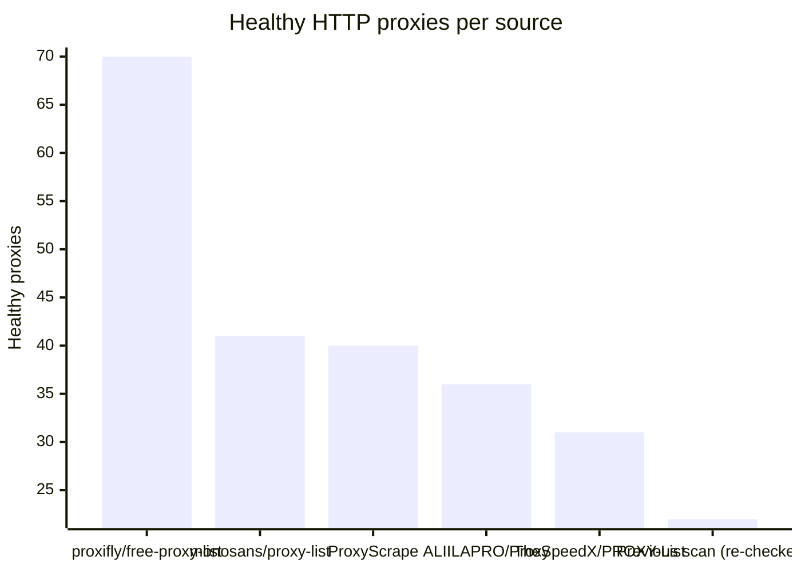
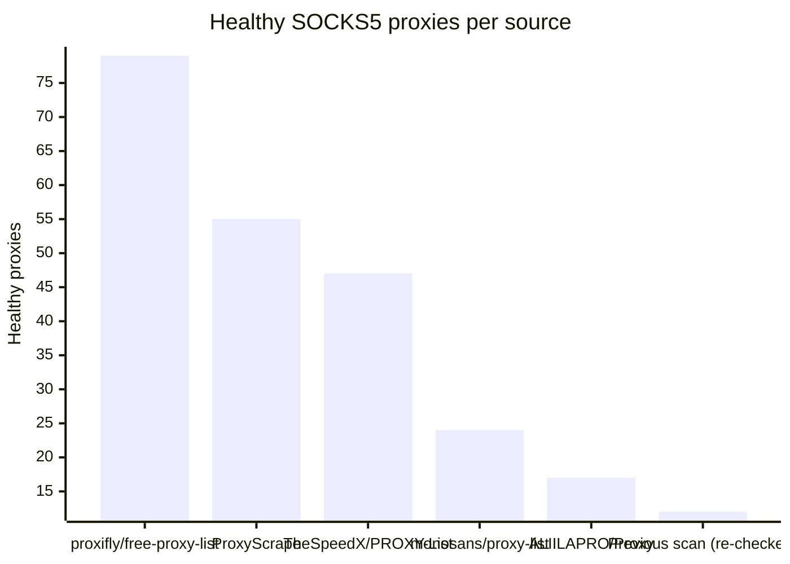

# Proxy Configs

<!-- dynamic timestamp placeholders for workflow sed script -->
channel_stats_chart.svg?v=1791309724
performance_report.html?v=1791309724

### Performance Chart

### Performance Report
[View Report](assets/performance_report.html?v=1791309724)

## HTTP

<!-- STATS:HTTP:START -->

_Last updated: 2026-11-06 06:16 UTC_

```mermaid
xychart-beta
    title "Healthy HTTP proxies per source"
    x-axis ["proxifly/free-proxy-list", "monosans/proxy-list", "ProxyScrape", "ALIILAPRO/Proxy", "TheSpeedX/PROXY-List", "Previous scan (re-checked)"]
    y-axis "Healthy proxies"
    bar [70, 41, 40, 36, 31, 22]
```

| Source | Healthy proxies |
|---|---|
| proxifly/free-proxy-list | 70 |
| monosans/proxy-list | 41 |
| ProxyScrape | 40 |
| ALIILAPRO/Proxy | 36 |
| TheSpeedX/PROXY-List | 31 |
| Previous scan (re-checked) | 22 |
| **Total unique** | **240** |

<!-- STATS:HTTP:END -->

## SOCKS5

<!-- STATS:SOCKS5:START -->

_Last updated: 2026-11-06 06:16 UTC_

```mermaid
xychart-beta
    title "Healthy SOCKS5 proxies per source"
    x-axis ["proxifly/free-proxy-list", "ProxyScrape", "TheSpeedX/PROXY-List", "monosans/proxy-list", "ALIILAPRO/Proxy", "Previous scan (re-checked)"]
    y-axis "Healthy proxies"
    bar [79, 55, 47, 24, 17, 12]
```

| Source | Healthy proxies |
|---|---|
| proxifly/free-proxy-list | 79 |
| ProxyScrape | 55 |
| TheSpeedX/PROXY-List | 47 |
| monosans/proxy-list | 24 |
| ALIILAPRO/Proxy | 17 |
| Previous scan (re-checked) | 12 |
| **Total unique** | **234** |

<!-- STATS:SOCKS5:END -->
