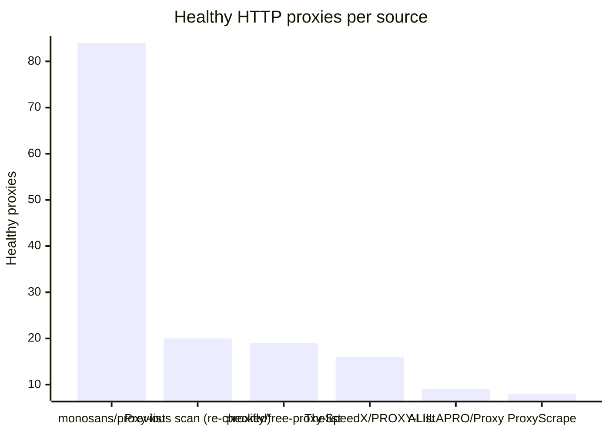
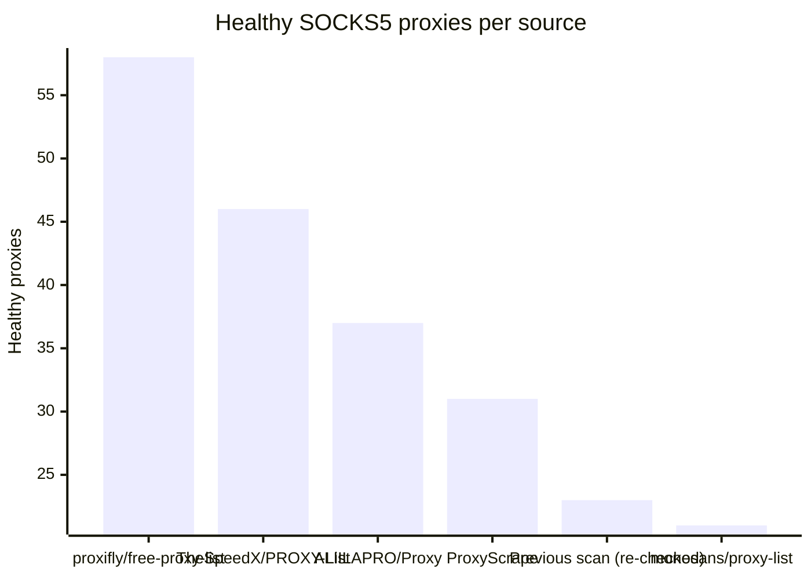

# Proxy Configs

<!-- dynamic timestamp placeholders for workflow sed script -->
channel_stats_chart.svg?v=1791309724
performance_report.html?v=1791309724

### Performance Chart

### Performance Report
[View Report](assets/performance_report.html?v=1791309724)

## HTTP

<!-- STATS:HTTP:START -->

_Last updated: 2026-11-02 18:18 UTC_

```mermaid
xychart-beta
    title "Healthy HTTP proxies per source"
    x-axis ["monosans/proxy-list", "Previous scan (re-checked)", "proxifly/free-proxy-list", "TheSpeedX/PROXY-List", "ALIILAPRO/Proxy", "ProxyScrape"]
    y-axis "Healthy proxies"
    bar [84, 20, 19, 16, 9, 8]
```

| Source | Healthy proxies |
|---|---|
| monosans/proxy-list | 84 |
| Previous scan (re-checked) | 20 |
| proxifly/free-proxy-list | 19 |
| TheSpeedX/PROXY-List | 16 |
| ALIILAPRO/Proxy | 9 |
| ProxyScrape | 8 |
| **Total unique** | **156** |

<!-- STATS:HTTP:END -->

## SOCKS5

<!-- STATS:SOCKS5:START -->

_Last updated: 2026-11-02 18:18 UTC_

```mermaid
xychart-beta
    title "Healthy SOCKS5 proxies per source"
    x-axis ["proxifly/free-proxy-list", "TheSpeedX/PROXY-List", "ALIILAPRO/Proxy", "ProxyScrape", "Previous scan (re-checked)", "monosans/proxy-list"]
    y-axis "Healthy proxies"
    bar [58, 46, 37, 31, 23, 21]
```

| Source | Healthy proxies |
|---|---|
| proxifly/free-proxy-list | 58 |
| TheSpeedX/PROXY-List | 46 |
| ALIILAPRO/Proxy | 37 |
| ProxyScrape | 31 |
| Previous scan (re-checked) | 23 |
| monosans/proxy-list | 21 |
| **Total unique** | **216** |

<!-- STATS:SOCKS5:END -->
