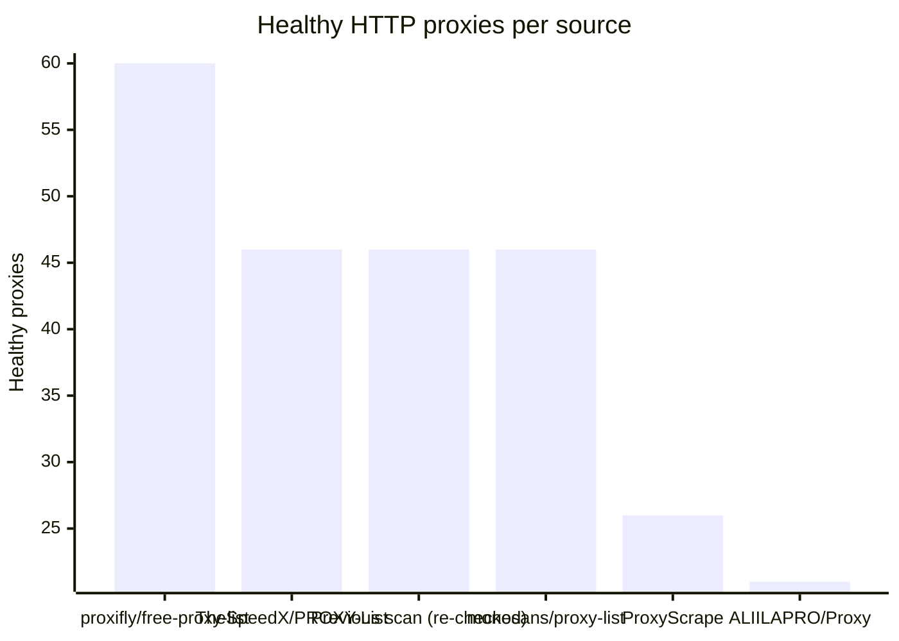
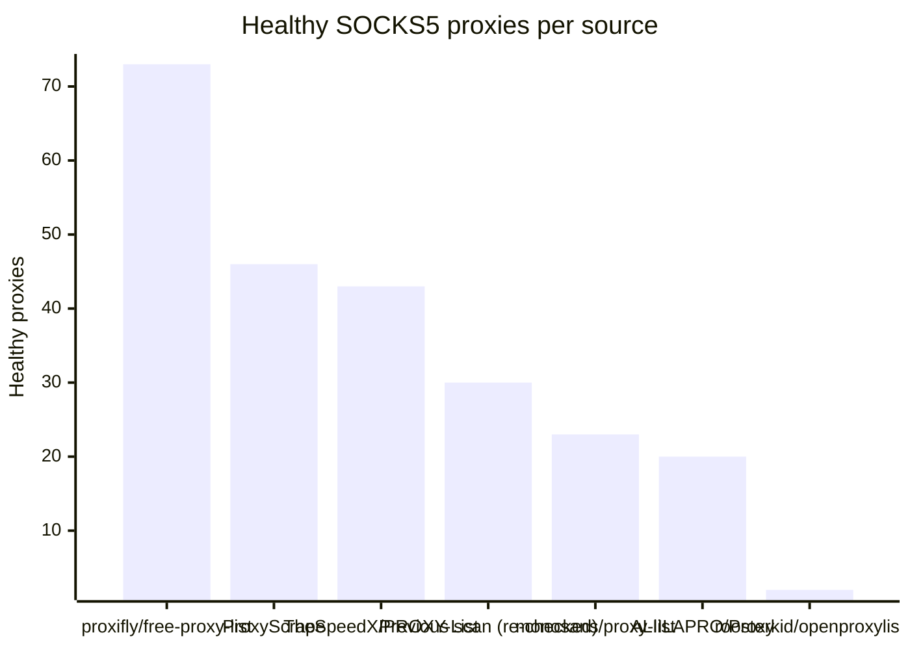

# Proxy Configs

<!-- dynamic timestamp placeholders for workflow sed script -->
channel_stats_chart.svg?v=1793793722
performance_report.html?v=1793793722

### Performance Chart

### Performance Report
[View Report](assets/performance_report.html?v=1793793722)

## HTTP

<!-- STATS:HTTP:START -->

_Last updated: 2026-11-04 06:18 UTC_

```mermaid
xychart-beta
    title "Healthy HTTP proxies per source"
    x-axis ["proxifly/free-proxy-list", "TheSpeedX/PROXY-List", "Previous scan (re-checked)", "monosans/proxy-list", "ProxyScrape", "ALIILAPRO/Proxy"]
    y-axis "Healthy proxies"
    bar [60, 46, 46, 46, 26, 21]
```

| Source | Healthy proxies |
|---|---|
| proxifly/free-proxy-list | 60 |
| TheSpeedX/PROXY-List | 46 |
| Previous scan (re-checked) | 46 |
| monosans/proxy-list | 46 |
| ProxyScrape | 26 |
| ALIILAPRO/Proxy | 21 |
| **Total unique** | **245** |

<!-- STATS:HTTP:END -->

## SOCKS5

<!-- STATS:SOCKS5:START -->

_Last updated: 2026-11-04 06:18 UTC_

```mermaid
xychart-beta
    title "Healthy SOCKS5 proxies per source"
    x-axis ["proxifly/free-proxy-list", "ProxyScrape", "TheSpeedX/PROXY-List", "Previous scan (re-checked)", "monosans/proxy-list", "ALIILAPRO/Proxy", "roosterkid/openproxylist"]
    y-axis "Healthy proxies"
    bar [73, 46, 43, 30, 23, 20, 2]
```

| Source | Healthy proxies |
|---|---|
| proxifly/free-proxy-list | 73 |
| ProxyScrape | 46 |
| TheSpeedX/PROXY-List | 43 |
| Previous scan (re-checked) | 30 |
| monosans/proxy-list | 23 |
| ALIILAPRO/Proxy | 20 |
| roosterkid/openproxylist | 2 |
| **Total unique** | **237** |

<!-- STATS:SOCKS5:END -->
