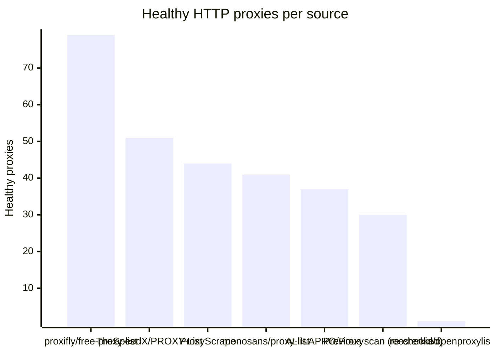
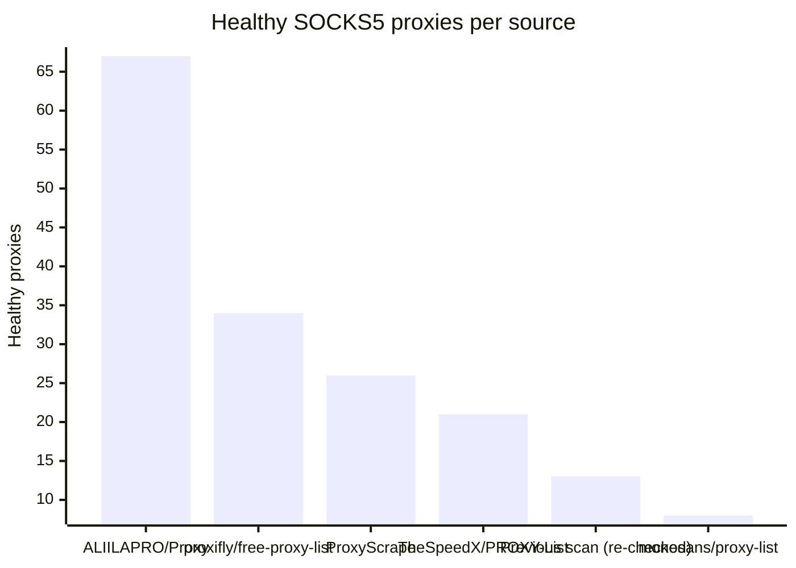

# Proxy Configs

<!-- dynamic timestamp placeholders for workflow sed script -->
channel_stats_chart.svg?v=1791309724
performance_report.html?v=1791309724

### Performance Chart

### Performance Report
[View Report](assets/performance_report.html?v=1791309724)

## HTTP

<!-- STATS:HTTP:START -->

_Last updated: 2026-11-06 00:16 UTC_

```mermaid
xychart-beta
    title "Healthy HTTP proxies per source"
    x-axis ["proxifly/free-proxy-list", "TheSpeedX/PROXY-List", "ProxyScrape", "monosans/proxy-list", "ALIILAPRO/Proxy", "Previous scan (re-checked)", "roosterkid/openproxylist"]
    y-axis "Healthy proxies"
    bar [79, 51, 44, 41, 37, 30, 1]
```

| Source | Healthy proxies |
|---|---|
| proxifly/free-proxy-list | 79 |
| TheSpeedX/PROXY-List | 51 |
| ProxyScrape | 44 |
| monosans/proxy-list | 41 |
| ALIILAPRO/Proxy | 37 |
| Previous scan (re-checked) | 30 |
| roosterkid/openproxylist | 1 |
| **Total unique** | **283** |

<!-- STATS:HTTP:END -->

## SOCKS5

<!-- STATS:SOCKS5:START -->

_Last updated: 2026-11-06 00:16 UTC_

```mermaid
xychart-beta
    title "Healthy SOCKS5 proxies per source"
    x-axis ["ALIILAPRO/Proxy", "proxifly/free-proxy-list", "ProxyScrape", "TheSpeedX/PROXY-List", "Previous scan (re-checked)", "monosans/proxy-list"]
    y-axis "Healthy proxies"
    bar [67, 34, 26, 21, 13, 8]
```

| Source | Healthy proxies |
|---|---|
| ALIILAPRO/Proxy | 67 |
| proxifly/free-proxy-list | 34 |
| ProxyScrape | 26 |
| TheSpeedX/PROXY-List | 21 |
| Previous scan (re-checked) | 13 |
| monosans/proxy-list | 8 |
| **Total unique** | **169** |

<!-- STATS:SOCKS5:END -->
