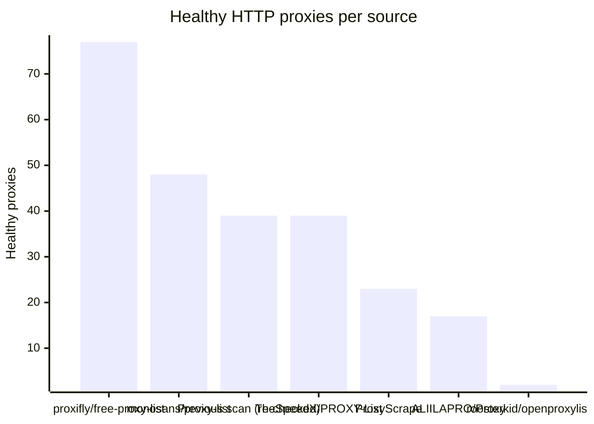
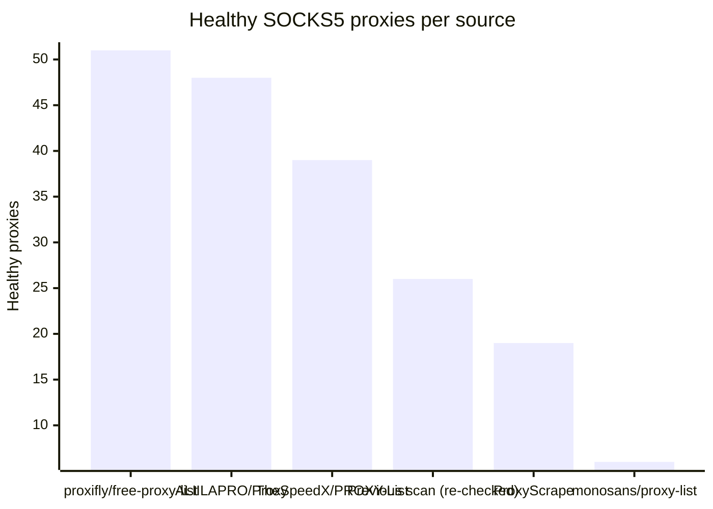

# Proxy Configs

<!-- dynamic timestamp placeholders for workflow sed script -->
channel_stats_chart.svg?v=1794182530
performance_report.html?v=1794182530

### Performance Chart

### Performance Report
[View Report](assets/performance_report.html?v=1794182530)

## HTTP

<!-- STATS:HTTP:START -->

_Last updated: 2026-11-08 18:17 UTC_

```mermaid
xychart-beta
    title "Healthy HTTP proxies per source"
    x-axis ["proxifly/free-proxy-list", "monosans/proxy-list", "Previous scan (re-checked)", "TheSpeedX/PROXY-List", "ProxyScrape", "ALIILAPRO/Proxy", "roosterkid/openproxylist"]
    y-axis "Healthy proxies"
    bar [77, 48, 39, 39, 23, 17, 2]
```

| Source | Healthy proxies |
|---|---|
| proxifly/free-proxy-list | 77 |
| monosans/proxy-list | 48 |
| Previous scan (re-checked) | 39 |
| TheSpeedX/PROXY-List | 39 |
| ProxyScrape | 23 |
| ALIILAPRO/Proxy | 17 |
| roosterkid/openproxylist | 2 |
| **Total unique** | **245** |

<!-- STATS:HTTP:END -->

## SOCKS5

<!-- STATS:SOCKS5:START -->

_Last updated: 2026-11-08 18:17 UTC_

```mermaid
xychart-beta
    title "Healthy SOCKS5 proxies per source"
    x-axis ["proxifly/free-proxy-list", "ALIILAPRO/Proxy", "TheSpeedX/PROXY-List", "Previous scan (re-checked)", "ProxyScrape", "monosans/proxy-list"]
    y-axis "Healthy proxies"
    bar [51, 48, 39, 26, 19, 6]
```

| Source | Healthy proxies |
|---|---|
| proxifly/free-proxy-list | 51 |
| ALIILAPRO/Proxy | 48 |
| TheSpeedX/PROXY-List | 39 |
| Previous scan (re-checked) | 26 |
| ProxyScrape | 19 |
| monosans/proxy-list | 6 |
| **Total unique** | **189** |

<!-- STATS:SOCKS5:END -->
