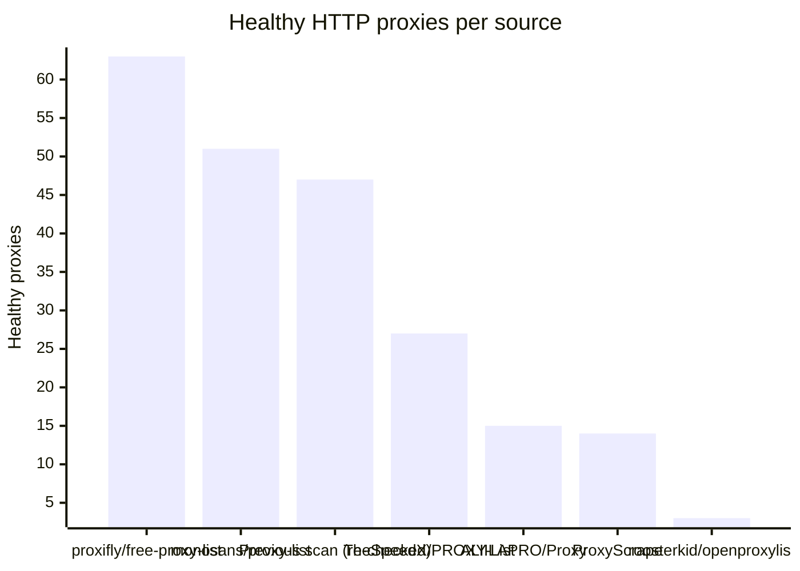
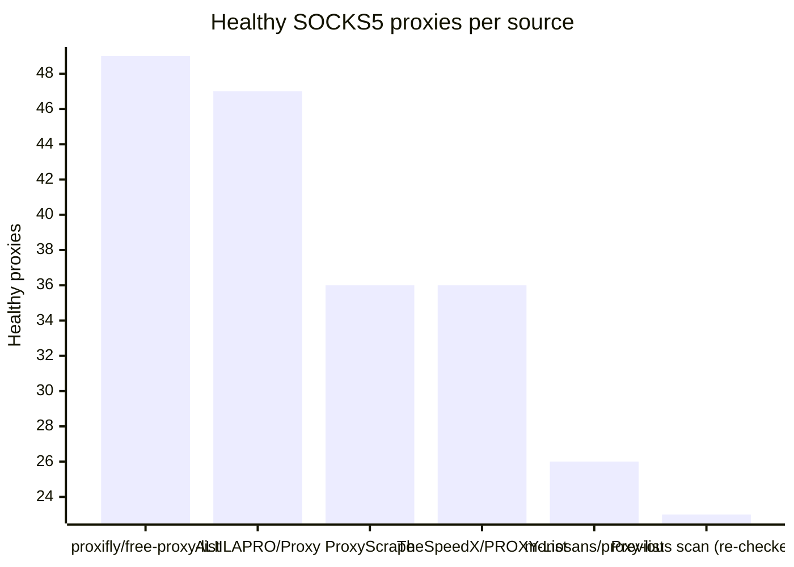

# Proxy Configs

<!-- dynamic timestamp placeholders for workflow sed script -->
channel_stats_chart.svg?v=1791309724
performance_report.html?v=1791309724

### Performance Chart

### Performance Report
[View Report](assets/performance_report.html?v=1791309724)

## HTTP

<!-- STATS:HTTP:START -->

_Last updated: 2026-11-05 12:17 UTC_

```mermaid
xychart-beta
    title "Healthy HTTP proxies per source"
    x-axis ["proxifly/free-proxy-list", "monosans/proxy-list", "Previous scan (re-checked)", "TheSpeedX/PROXY-List", "ALIILAPRO/Proxy", "ProxyScrape", "roosterkid/openproxylist"]
    y-axis "Healthy proxies"
    bar [63, 51, 47, 27, 15, 14, 3]
```

| Source | Healthy proxies |
|---|---|
| proxifly/free-proxy-list | 63 |
| monosans/proxy-list | 51 |
| Previous scan (re-checked) | 47 |
| TheSpeedX/PROXY-List | 27 |
| ALIILAPRO/Proxy | 15 |
| ProxyScrape | 14 |
| roosterkid/openproxylist | 3 |
| **Total unique** | **220** |

<!-- STATS:HTTP:END -->

## SOCKS5

<!-- STATS:SOCKS5:START -->

_Last updated: 2026-11-05 12:17 UTC_

```mermaid
xychart-beta
    title "Healthy SOCKS5 proxies per source"
    x-axis ["proxifly/free-proxy-list", "ALIILAPRO/Proxy", "ProxyScrape", "TheSpeedX/PROXY-List", "monosans/proxy-list", "Previous scan (re-checked)"]
    y-axis "Healthy proxies"
    bar [49, 47, 36, 36, 26, 23]
```

| Source | Healthy proxies |
|---|---|
| proxifly/free-proxy-list | 49 |
| ALIILAPRO/Proxy | 47 |
| ProxyScrape | 36 |
| TheSpeedX/PROXY-List | 36 |
| monosans/proxy-list | 26 |
| Previous scan (re-checked) | 23 |
| **Total unique** | **217** |

<!-- STATS:SOCKS5:END -->
