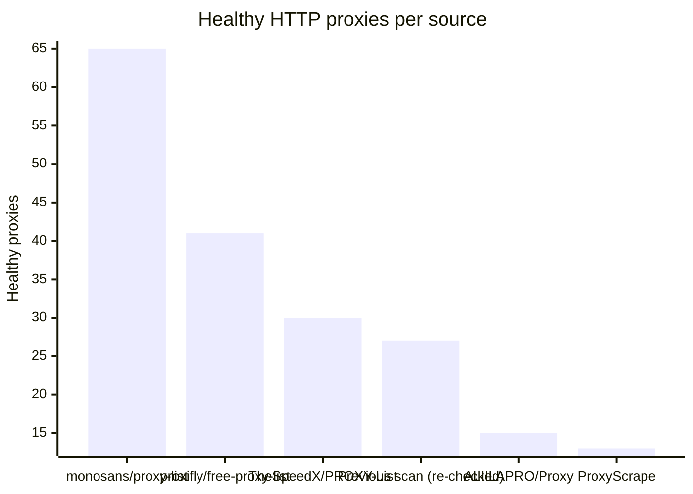
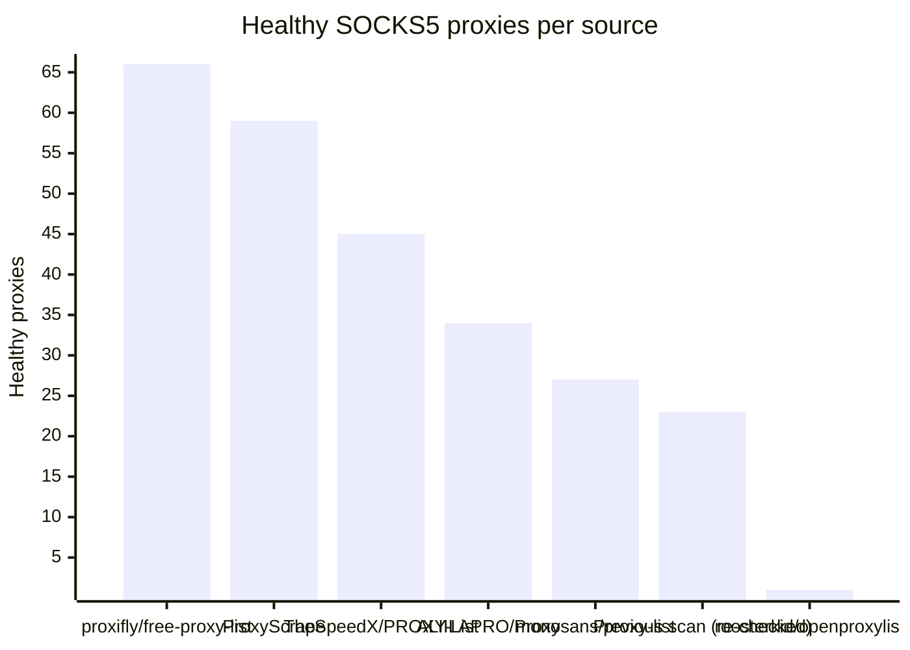

# Proxy Configs

<!-- dynamic timestamp placeholders for workflow sed script -->
channel_stats_chart.svg?v=1791309724
performance_report.html?v=1791309724

### Performance Chart

### Performance Report
[View Report](assets/performance_report.html?v=1791309724)

## HTTP

<!-- STATS:HTTP:START -->

_Last updated: 2026-11-02 12:15 UTC_

```mermaid
xychart-beta
    title "Healthy HTTP proxies per source"
    x-axis ["monosans/proxy-list", "proxifly/free-proxy-list", "TheSpeedX/PROXY-List", "Previous scan (re-checked)", "ALIILAPRO/Proxy", "ProxyScrape"]
    y-axis "Healthy proxies"
    bar [65, 41, 30, 27, 15, 13]
```

| Source | Healthy proxies |
|---|---|
| monosans/proxy-list | 65 |
| proxifly/free-proxy-list | 41 |
| TheSpeedX/PROXY-List | 30 |
| Previous scan (re-checked) | 27 |
| ALIILAPRO/Proxy | 15 |
| ProxyScrape | 13 |
| **Total unique** | **191** |

<!-- STATS:HTTP:END -->

## SOCKS5

<!-- STATS:SOCKS5:START -->

_Last updated: 2026-11-02 12:15 UTC_

```mermaid
xychart-beta
    title "Healthy SOCKS5 proxies per source"
    x-axis ["proxifly/free-proxy-list", "ProxyScrape", "TheSpeedX/PROXY-List", "ALIILAPRO/Proxy", "monosans/proxy-list", "Previous scan (re-checked)", "roosterkid/openproxylist"]
    y-axis "Healthy proxies"
    bar [66, 59, 45, 34, 27, 23, 1]
```

| Source | Healthy proxies |
|---|---|
| proxifly/free-proxy-list | 66 |
| ProxyScrape | 59 |
| TheSpeedX/PROXY-List | 45 |
| ALIILAPRO/Proxy | 34 |
| monosans/proxy-list | 27 |
| Previous scan (re-checked) | 23 |
| roosterkid/openproxylist | 1 |
| **Total unique** | **255** |

<!-- STATS:SOCKS5:END -->
