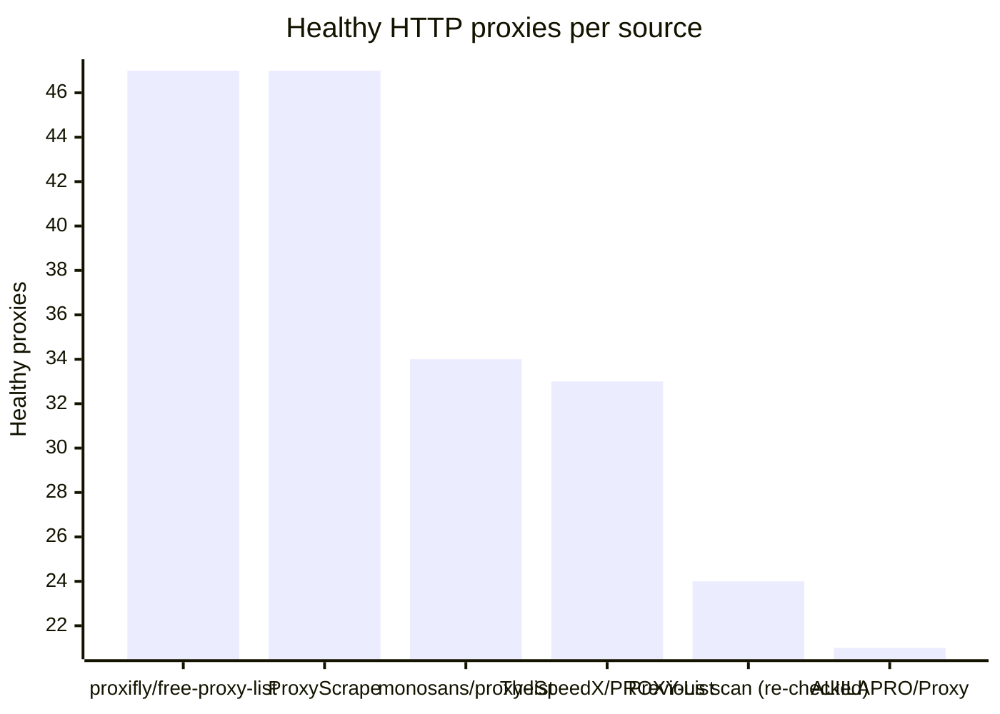
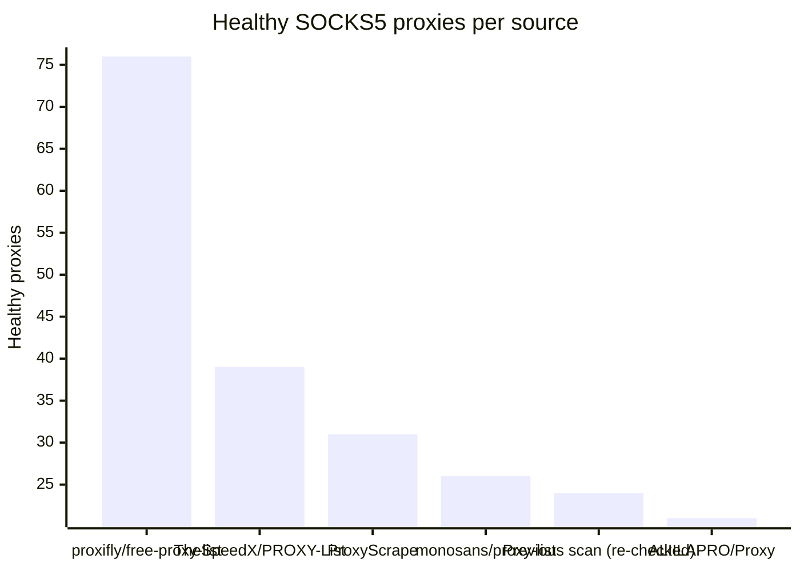

# Proxy Configs

<!-- dynamic timestamp placeholders for workflow sed script -->
channel_stats_chart.svg?v=1791309724
performance_report.html?v=1791309724

### Performance Chart

### Performance Report
[View Report](assets/performance_report.html?v=1791309724)

## HTTP

<!-- STATS:HTTP:START -->

_Last updated: 2026-11-04 18:19 UTC_

```mermaid
xychart-beta
    title "Healthy HTTP proxies per source"
    x-axis ["proxifly/free-proxy-list", "ProxyScrape", "monosans/proxy-list", "TheSpeedX/PROXY-List", "Previous scan (re-checked)", "ALIILAPRO/Proxy"]
    y-axis "Healthy proxies"
    bar [47, 47, 34, 33, 24, 21]
```

| Source | Healthy proxies |
|---|---|
| proxifly/free-proxy-list | 47 |
| ProxyScrape | 47 |
| monosans/proxy-list | 34 |
| TheSpeedX/PROXY-List | 33 |
| Previous scan (re-checked) | 24 |
| ALIILAPRO/Proxy | 21 |
| **Total unique** | **206** |

<!-- STATS:HTTP:END -->

## SOCKS5

<!-- STATS:SOCKS5:START -->

_Last updated: 2026-11-04 18:19 UTC_

```mermaid
xychart-beta
    title "Healthy SOCKS5 proxies per source"
    x-axis ["proxifly/free-proxy-list", "TheSpeedX/PROXY-List", "ProxyScrape", "monosans/proxy-list", "Previous scan (re-checked)", "ALIILAPRO/Proxy"]
    y-axis "Healthy proxies"
    bar [76, 39, 31, 26, 24, 21]
```

| Source | Healthy proxies |
|---|---|
| proxifly/free-proxy-list | 76 |
| TheSpeedX/PROXY-List | 39 |
| ProxyScrape | 31 |
| monosans/proxy-list | 26 |
| Previous scan (re-checked) | 24 |
| ALIILAPRO/Proxy | 21 |
| **Total unique** | **217** |

<!-- STATS:SOCKS5:END -->
