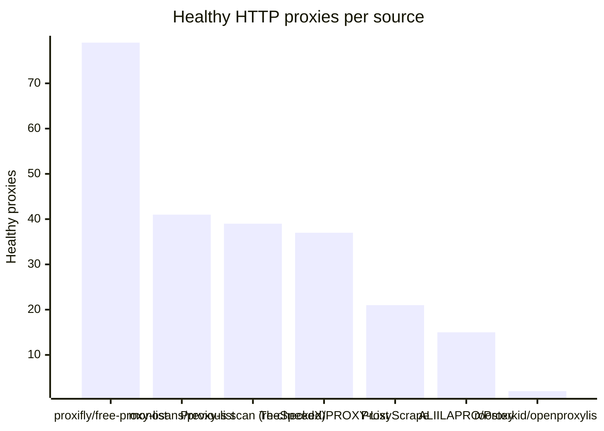
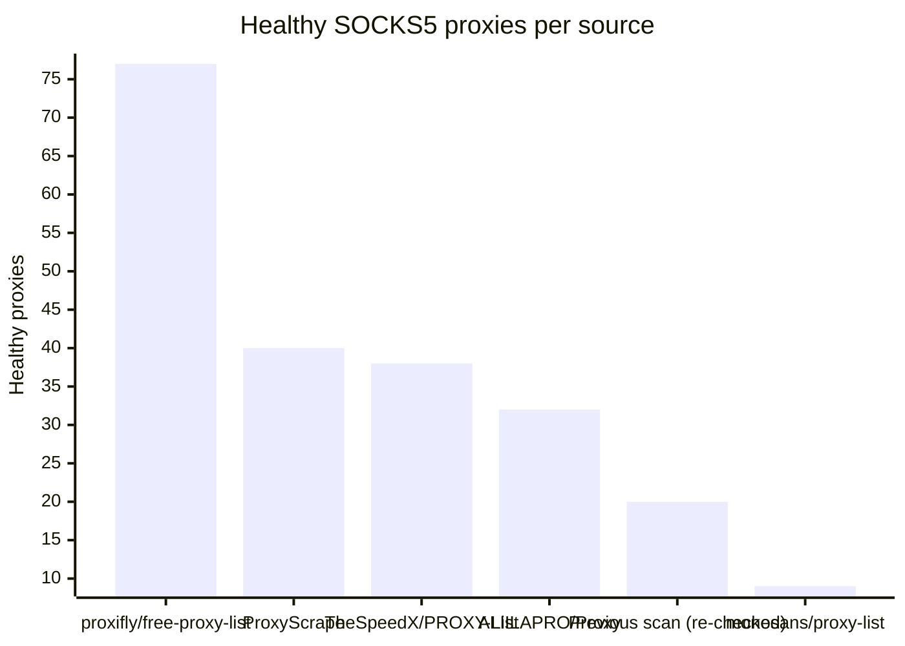

# Proxy Configs

<!-- dynamic timestamp placeholders for workflow sed script -->
channel_stats_chart.svg?v=1791309724
performance_report.html?v=1791309724

### Performance Chart

### Performance Report
[View Report](assets/performance_report.html?v=1791309724)

## HTTP

<!-- STATS:HTTP:START -->

_Last updated: 2026-11-10 00:15 UTC_

```mermaid
xychart-beta
    title "Healthy HTTP proxies per source"
    x-axis ["proxifly/free-proxy-list", "monosans/proxy-list", "Previous scan (re-checked)", "TheSpeedX/PROXY-List", "ProxyScrape", "ALIILAPRO/Proxy", "roosterkid/openproxylist"]
    y-axis "Healthy proxies"
    bar [79, 41, 39, 37, 21, 15, 2]
```

| Source | Healthy proxies |
|---|---|
| proxifly/free-proxy-list | 79 |
| monosans/proxy-list | 41 |
| Previous scan (re-checked) | 39 |
| TheSpeedX/PROXY-List | 37 |
| ProxyScrape | 21 |
| ALIILAPRO/Proxy | 15 |
| roosterkid/openproxylist | 2 |
| **Total unique** | **234** |

<!-- STATS:HTTP:END -->

## SOCKS5

<!-- STATS:SOCKS5:START -->

_Last updated: 2026-11-10 00:15 UTC_

```mermaid
xychart-beta
    title "Healthy SOCKS5 proxies per source"
    x-axis ["proxifly/free-proxy-list", "ProxyScrape", "TheSpeedX/PROXY-List", "ALIILAPRO/Proxy", "Previous scan (re-checked)", "monosans/proxy-list"]
    y-axis "Healthy proxies"
    bar [77, 40, 38, 32, 20, 9]
```

| Source | Healthy proxies |
|---|---|
| proxifly/free-proxy-list | 77 |
| ProxyScrape | 40 |
| TheSpeedX/PROXY-List | 38 |
| ALIILAPRO/Proxy | 32 |
| Previous scan (re-checked) | 20 |
| monosans/proxy-list | 9 |
| **Total unique** | **216** |

<!-- STATS:SOCKS5:END -->
