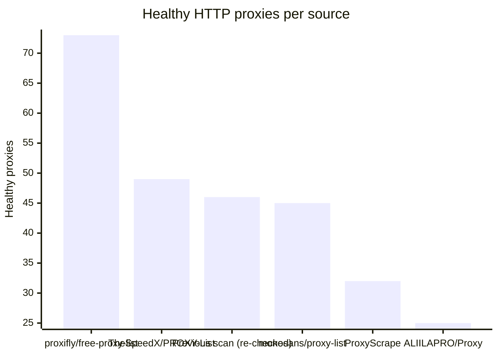
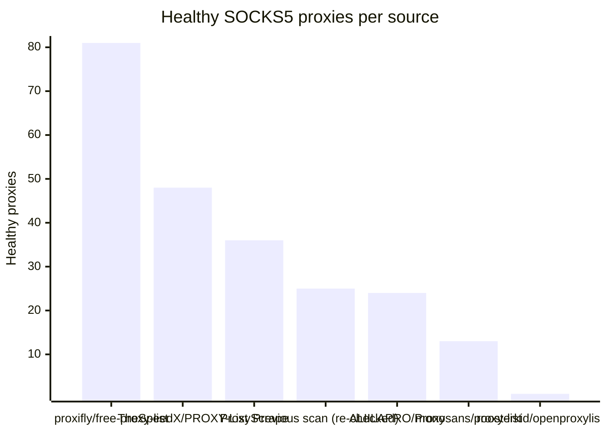

# Proxy Configs

<!-- dynamic timestamp placeholders for workflow sed script -->
channel_stats_chart.svg?v=1794312214
performance_report.html?v=1794312214

### Performance Chart

### Performance Report
[View Report](assets/performance_report.html?v=1794312214)

## HTTP

<!-- STATS:HTTP:START -->

_Last updated: 2026-11-10 06:14 UTC_

```mermaid
xychart-beta
    title "Healthy HTTP proxies per source"
    x-axis ["proxifly/free-proxy-list", "TheSpeedX/PROXY-List", "Previous scan (re-checked)", "monosans/proxy-list", "ProxyScrape", "ALIILAPRO/Proxy"]
    y-axis "Healthy proxies"
    bar [73, 49, 46, 45, 32, 25]
```

| Source | Healthy proxies |
|---|---|
| proxifly/free-proxy-list | 73 |
| TheSpeedX/PROXY-List | 49 |
| Previous scan (re-checked) | 46 |
| monosans/proxy-list | 45 |
| ProxyScrape | 32 |
| ALIILAPRO/Proxy | 25 |
| **Total unique** | **270** |

<!-- STATS:HTTP:END -->

## SOCKS5

<!-- STATS:SOCKS5:START -->

_Last updated: 2026-11-10 06:14 UTC_

```mermaid
xychart-beta
    title "Healthy SOCKS5 proxies per source"
    x-axis ["proxifly/free-proxy-list", "TheSpeedX/PROXY-List", "ProxyScrape", "Previous scan (re-checked)", "ALIILAPRO/Proxy", "monosans/proxy-list", "roosterkid/openproxylist"]
    y-axis "Healthy proxies"
    bar [81, 48, 36, 25, 24, 13, 1]
```

| Source | Healthy proxies |
|---|---|
| proxifly/free-proxy-list | 81 |
| TheSpeedX/PROXY-List | 48 |
| ProxyScrape | 36 |
| Previous scan (re-checked) | 25 |
| ALIILAPRO/Proxy | 24 |
| monosans/proxy-list | 13 |
| roosterkid/openproxylist | 1 |
| **Total unique** | **228** |

<!-- STATS:SOCKS5:END -->
