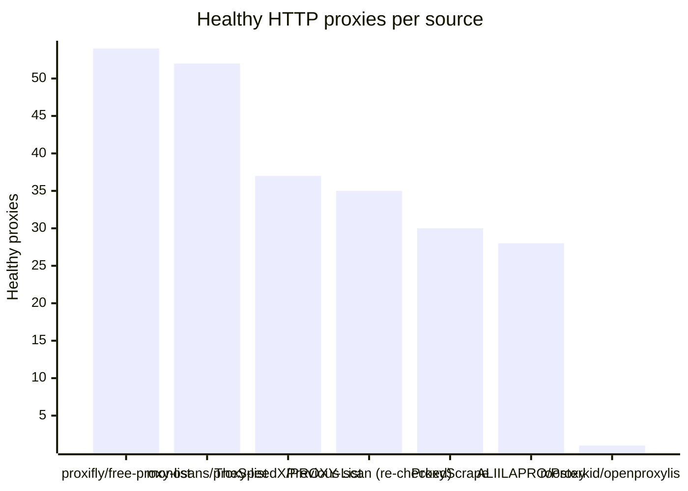
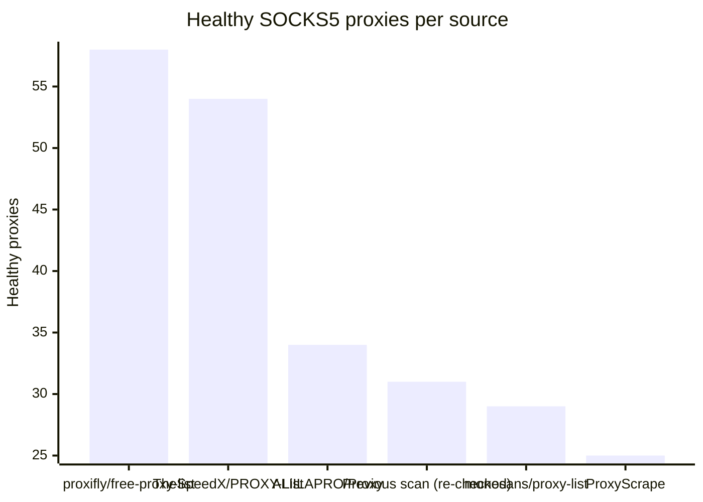

# Proxy Configs

<!-- dynamic timestamp placeholders for workflow sed script -->
channel_stats_chart.svg?v=1791309724
performance_report.html?v=1791309724

### Performance Chart

### Performance Report
[View Report](assets/performance_report.html?v=1791309724)

## HTTP

<!-- STATS:HTTP:START -->

_Last updated: 2026-11-03 18:18 UTC_

```mermaid
xychart-beta
    title "Healthy HTTP proxies per source"
    x-axis ["proxifly/free-proxy-list", "monosans/proxy-list", "TheSpeedX/PROXY-List", "Previous scan (re-checked)", "ProxyScrape", "ALIILAPRO/Proxy", "roosterkid/openproxylist"]
    y-axis "Healthy proxies"
    bar [54, 52, 37, 35, 30, 28, 1]
```

| Source | Healthy proxies |
|---|---|
| proxifly/free-proxy-list | 54 |
| monosans/proxy-list | 52 |
| TheSpeedX/PROXY-List | 37 |
| Previous scan (re-checked) | 35 |
| ProxyScrape | 30 |
| ALIILAPRO/Proxy | 28 |
| roosterkid/openproxylist | 1 |
| **Total unique** | **237** |

<!-- STATS:HTTP:END -->

## SOCKS5

<!-- STATS:SOCKS5:START -->

_Last updated: 2026-11-03 18:18 UTC_

```mermaid
xychart-beta
    title "Healthy SOCKS5 proxies per source"
    x-axis ["proxifly/free-proxy-list", "TheSpeedX/PROXY-List", "ALIILAPRO/Proxy", "Previous scan (re-checked)", "monosans/proxy-list", "ProxyScrape"]
    y-axis "Healthy proxies"
    bar [58, 54, 34, 31, 29, 25]
```

| Source | Healthy proxies |
|---|---|
| proxifly/free-proxy-list | 58 |
| TheSpeedX/PROXY-List | 54 |
| ALIILAPRO/Proxy | 34 |
| Previous scan (re-checked) | 31 |
| monosans/proxy-list | 29 |
| ProxyScrape | 25 |
| **Total unique** | **231** |

<!-- STATS:SOCKS5:END -->
