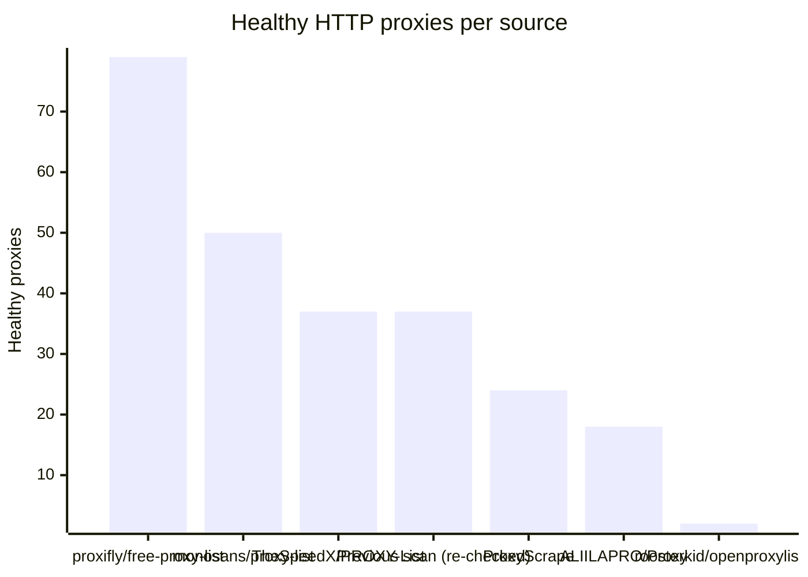
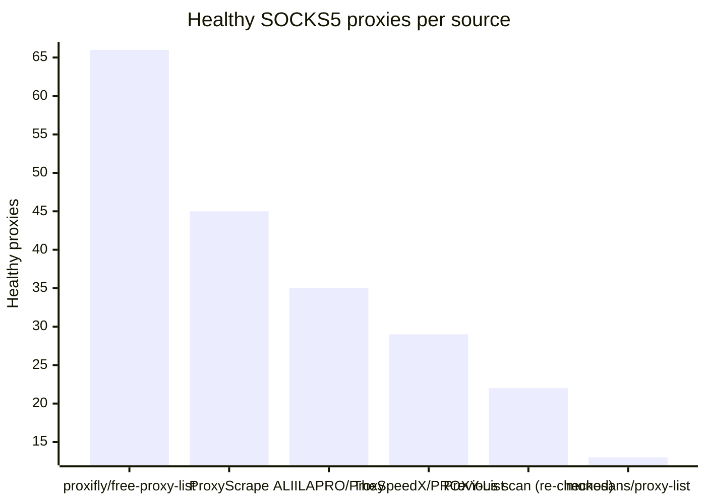

# Proxy Configs

<!-- dynamic timestamp placeholders for workflow sed script -->
channel_stats_chart.svg?v=1794225752
performance_report.html?v=1794225752

### Performance Chart

### Performance Report
[View Report](assets/performance_report.html?v=1794225752)

## HTTP

<!-- STATS:HTTP:START -->

_Last updated: 2026-11-09 06:15 UTC_

```mermaid
xychart-beta
    title "Healthy HTTP proxies per source"
    x-axis ["proxifly/free-proxy-list", "monosans/proxy-list", "TheSpeedX/PROXY-List", "Previous scan (re-checked)", "ProxyScrape", "ALIILAPRO/Proxy", "roosterkid/openproxylist"]
    y-axis "Healthy proxies"
    bar [79, 50, 37, 37, 24, 18, 2]
```

| Source | Healthy proxies |
|---|---|
| proxifly/free-proxy-list | 79 |
| monosans/proxy-list | 50 |
| TheSpeedX/PROXY-List | 37 |
| Previous scan (re-checked) | 37 |
| ProxyScrape | 24 |
| ALIILAPRO/Proxy | 18 |
| roosterkid/openproxylist | 2 |
| **Total unique** | **247** |

<!-- STATS:HTTP:END -->

## SOCKS5

<!-- STATS:SOCKS5:START -->

_Last updated: 2026-11-09 06:15 UTC_

```mermaid
xychart-beta
    title "Healthy SOCKS5 proxies per source"
    x-axis ["proxifly/free-proxy-list", "ProxyScrape", "ALIILAPRO/Proxy", "TheSpeedX/PROXY-List", "Previous scan (re-checked)", "monosans/proxy-list"]
    y-axis "Healthy proxies"
    bar [66, 45, 35, 29, 22, 13]
```

| Source | Healthy proxies |
|---|---|
| proxifly/free-proxy-list | 66 |
| ProxyScrape | 45 |
| ALIILAPRO/Proxy | 35 |
| TheSpeedX/PROXY-List | 29 |
| Previous scan (re-checked) | 22 |
| monosans/proxy-list | 13 |
| **Total unique** | **210** |

<!-- STATS:SOCKS5:END -->
