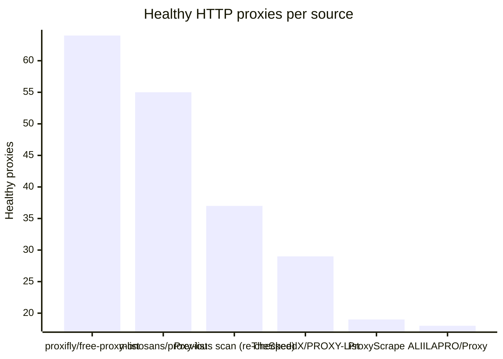
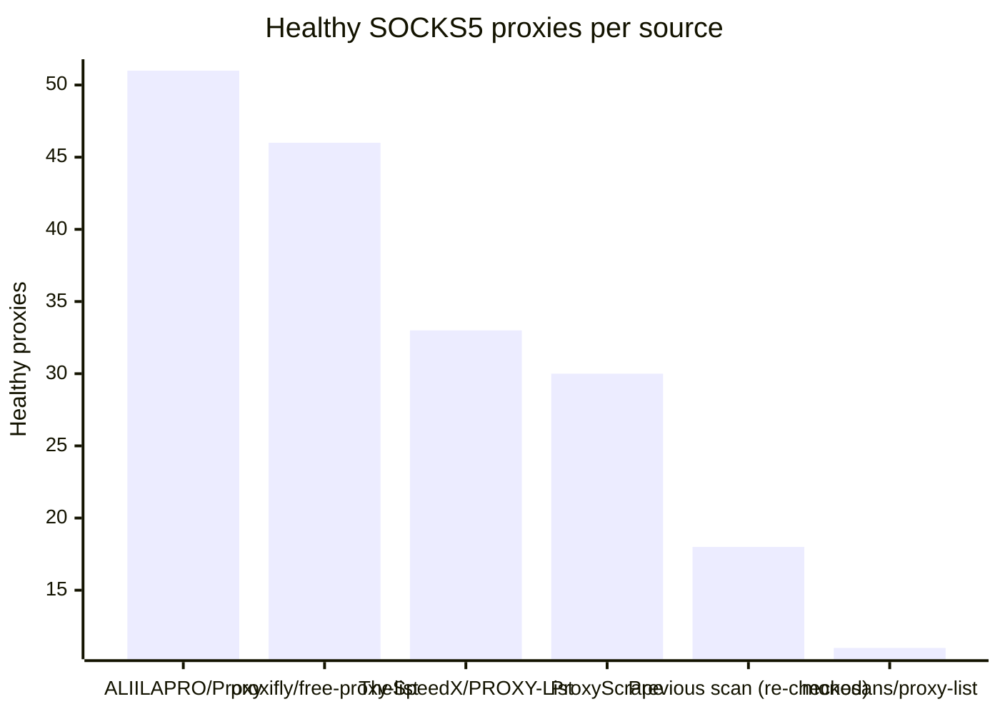

# Proxy Configs

<!-- dynamic timestamp placeholders for workflow sed script -->
channel_stats_chart.svg?v=1791309724
performance_report.html?v=1791309724

### Performance Chart

### Performance Report
[View Report](assets/performance_report.html?v=1791309724)

## HTTP

<!-- STATS:HTTP:START -->

_Last updated: 2026-11-05 18:18 UTC_

```mermaid
xychart-beta
    title "Healthy HTTP proxies per source"
    x-axis ["proxifly/free-proxy-list", "monosans/proxy-list", "Previous scan (re-checked)", "TheSpeedX/PROXY-List", "ProxyScrape", "ALIILAPRO/Proxy"]
    y-axis "Healthy proxies"
    bar [64, 55, 37, 29, 19, 18]
```

| Source | Healthy proxies |
|---|---|
| proxifly/free-proxy-list | 64 |
| monosans/proxy-list | 55 |
| Previous scan (re-checked) | 37 |
| TheSpeedX/PROXY-List | 29 |
| ProxyScrape | 19 |
| ALIILAPRO/Proxy | 18 |
| **Total unique** | **222** |

<!-- STATS:HTTP:END -->

## SOCKS5

<!-- STATS:SOCKS5:START -->

_Last updated: 2026-11-05 18:18 UTC_

```mermaid
xychart-beta
    title "Healthy SOCKS5 proxies per source"
    x-axis ["ALIILAPRO/Proxy", "proxifly/free-proxy-list", "TheSpeedX/PROXY-List", "ProxyScrape", "Previous scan (re-checked)", "monosans/proxy-list"]
    y-axis "Healthy proxies"
    bar [51, 46, 33, 30, 18, 11]
```

| Source | Healthy proxies |
|---|---|
| ALIILAPRO/Proxy | 51 |
| proxifly/free-proxy-list | 46 |
| TheSpeedX/PROXY-List | 33 |
| ProxyScrape | 30 |
| Previous scan (re-checked) | 18 |
| monosans/proxy-list | 11 |
| **Total unique** | **189** |

<!-- STATS:SOCKS5:END -->
