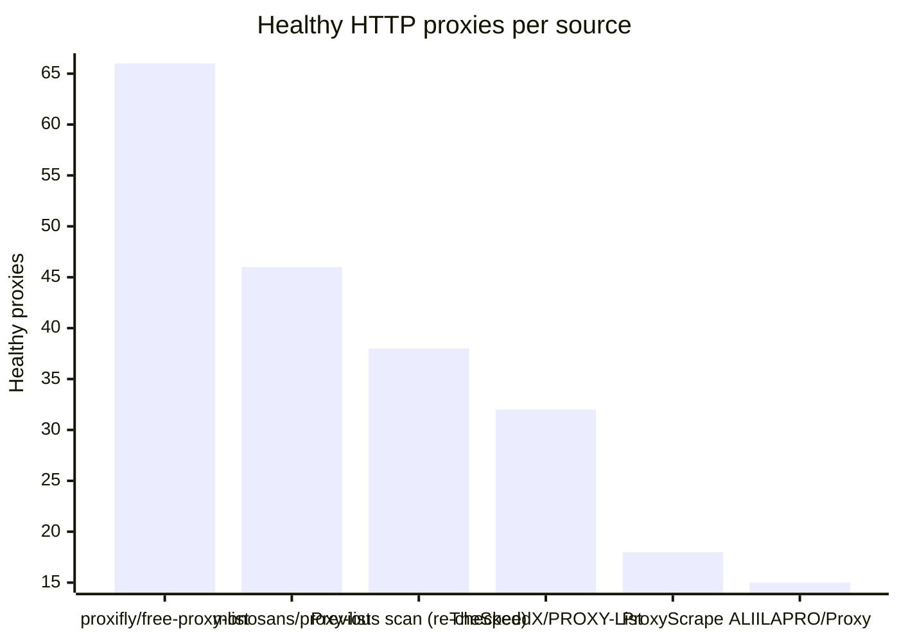
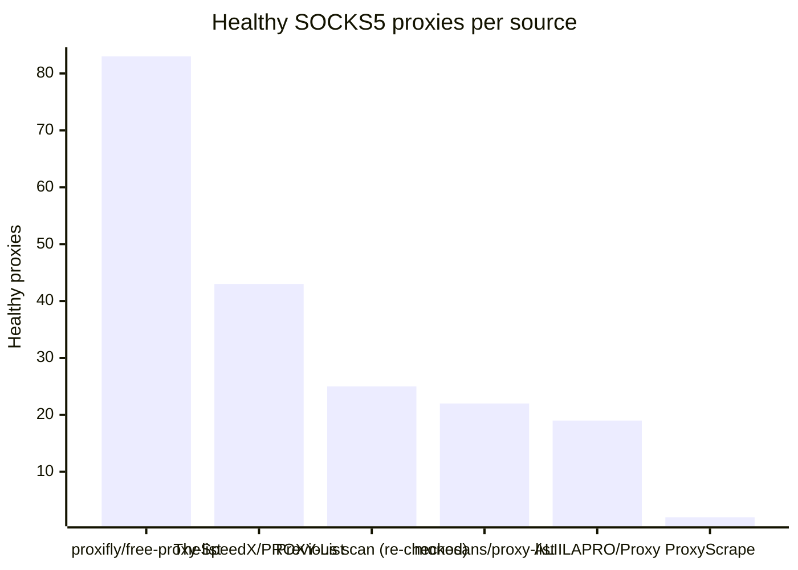

# Proxy Configs

<!-- dynamic timestamp placeholders for workflow sed script -->
channel_stats_chart.svg?v=1795737738
performance_report.html?v=1795737738

### Performance Chart

### Performance Report
[View Report](assets/performance_report.html?v=1795737738)

## HTTP

<!-- STATS:HTTP:START -->

_Last updated: 2026-11-26 18:13 UTC_

```mermaid
xychart-beta
    title "Healthy HTTP proxies per source"
    x-axis ["proxifly/free-proxy-list", "monosans/proxy-list", "Previous scan (re-checked)", "TheSpeedX/PROXY-List", "ProxyScrape", "ALIILAPRO/Proxy"]
    y-axis "Healthy proxies"
    bar [66, 46, 38, 32, 18, 15]
```

| Source | Healthy proxies |
|---|---|
| proxifly/free-proxy-list | 66 |
| monosans/proxy-list | 46 |
| Previous scan (re-checked) | 38 |
| TheSpeedX/PROXY-List | 32 |
| ProxyScrape | 18 |
| ALIILAPRO/Proxy | 15 |
| **Total unique** | **215** |

<!-- STATS:HTTP:END -->

## SOCKS5

<!-- STATS:SOCKS5:START -->

_Last updated: 2026-11-26 18:13 UTC_

```mermaid
xychart-beta
    title "Healthy SOCKS5 proxies per source"
    x-axis ["proxifly/free-proxy-list", "TheSpeedX/PROXY-List", "Previous scan (re-checked)", "monosans/proxy-list", "ALIILAPRO/Proxy", "ProxyScrape"]
    y-axis "Healthy proxies"
    bar [83, 43, 25, 22, 19, 2]
```

| Source | Healthy proxies |
|---|---|
| proxifly/free-proxy-list | 83 |
| TheSpeedX/PROXY-List | 43 |
| Previous scan (re-checked) | 25 |
| monosans/proxy-list | 22 |
| ALIILAPRO/Proxy | 19 |
| ProxyScrape | 2 |
| **Total unique** | **194** |

<!-- STATS:SOCKS5:END -->
