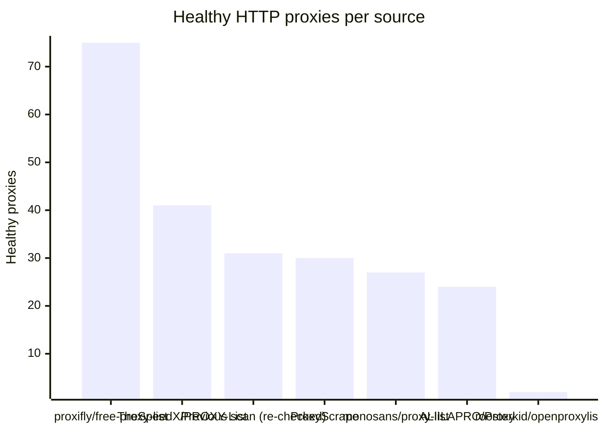
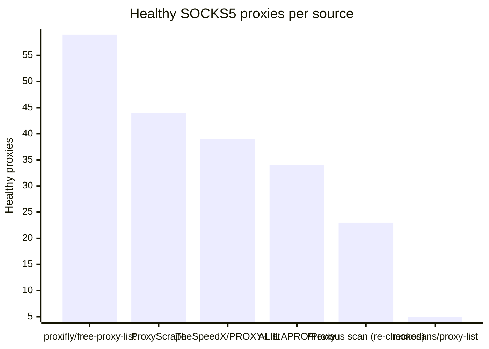

# Proxy Configs

<!-- dynamic timestamp placeholders for workflow sed script -->
channel_stats_chart.svg?v=1795132994
performance_report.html?v=1795132994

### Performance Chart

### Performance Report
[View Report](assets/performance_report.html?v=1795132994)

## HTTP

<!-- STATS:HTTP:START -->

_Last updated: 2026-11-19 18:13 UTC_

```mermaid
xychart-beta
    title "Healthy HTTP proxies per source"
    x-axis ["proxifly/free-proxy-list", "TheSpeedX/PROXY-List", "Previous scan (re-checked)", "ProxyScrape", "monosans/proxy-list", "ALIILAPRO/Proxy", "roosterkid/openproxylist"]
    y-axis "Healthy proxies"
    bar [75, 41, 31, 30, 27, 24, 2]
```

| Source | Healthy proxies |
|---|---|
| proxifly/free-proxy-list | 75 |
| TheSpeedX/PROXY-List | 41 |
| Previous scan (re-checked) | 31 |
| ProxyScrape | 30 |
| monosans/proxy-list | 27 |
| ALIILAPRO/Proxy | 24 |
| roosterkid/openproxylist | 2 |
| **Total unique** | **230** |

<!-- STATS:HTTP:END -->

## SOCKS5

<!-- STATS:SOCKS5:START -->

_Last updated: 2026-11-19 18:13 UTC_

```mermaid
xychart-beta
    title "Healthy SOCKS5 proxies per source"
    x-axis ["proxifly/free-proxy-list", "ProxyScrape", "TheSpeedX/PROXY-List", "ALIILAPRO/Proxy", "Previous scan (re-checked)", "monosans/proxy-list"]
    y-axis "Healthy proxies"
    bar [59, 44, 39, 34, 23, 5]
```

| Source | Healthy proxies |
|---|---|
| proxifly/free-proxy-list | 59 |
| ProxyScrape | 44 |
| TheSpeedX/PROXY-List | 39 |
| ALIILAPRO/Proxy | 34 |
| Previous scan (re-checked) | 23 |
| monosans/proxy-list | 5 |
| **Total unique** | **204** |

<!-- STATS:SOCKS5:END -->
