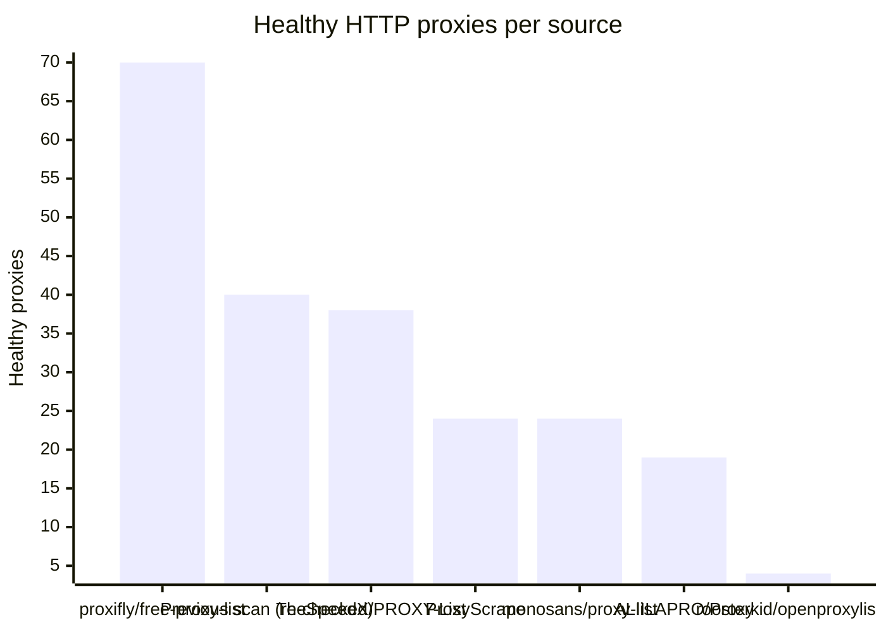
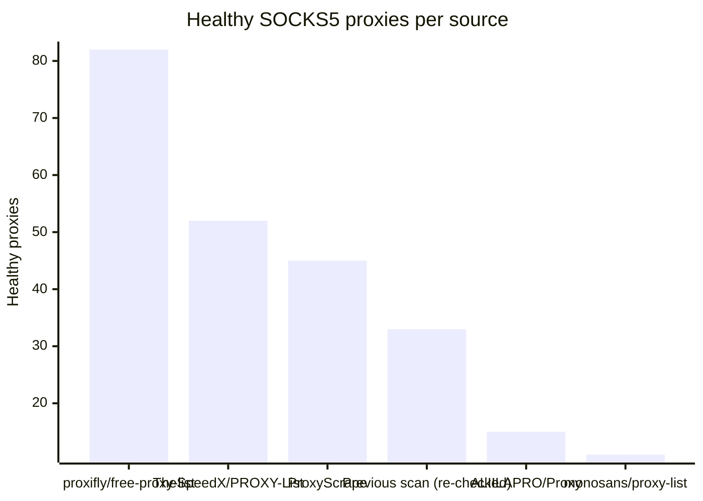

# Proxy Configs

<!-- dynamic timestamp placeholders for workflow sed script -->
channel_stats_chart.svg?v=1791309724
performance_report.html?v=1791309724

### Performance Chart

### Performance Report
[View Report](assets/performance_report.html?v=1791309724)

## HTTP

<!-- STATS:HTTP:START -->

_Last updated: 2026-11-23 12:13 UTC_

```mermaid
xychart-beta
    title "Healthy HTTP proxies per source"
    x-axis ["proxifly/free-proxy-list", "Previous scan (re-checked)", "TheSpeedX/PROXY-List", "ProxyScrape", "monosans/proxy-list", "ALIILAPRO/Proxy", "roosterkid/openproxylist"]
    y-axis "Healthy proxies"
    bar [70, 40, 38, 24, 24, 19, 4]
```

| Source | Healthy proxies |
|---|---|
| proxifly/free-proxy-list | 70 |
| Previous scan (re-checked) | 40 |
| TheSpeedX/PROXY-List | 38 |
| ProxyScrape | 24 |
| monosans/proxy-list | 24 |
| ALIILAPRO/Proxy | 19 |
| roosterkid/openproxylist | 4 |
| **Total unique** | **219** |

<!-- STATS:HTTP:END -->

## SOCKS5

<!-- STATS:SOCKS5:START -->

_Last updated: 2026-11-23 12:13 UTC_

```mermaid
xychart-beta
    title "Healthy SOCKS5 proxies per source"
    x-axis ["proxifly/free-proxy-list", "TheSpeedX/PROXY-List", "ProxyScrape", "Previous scan (re-checked)", "ALIILAPRO/Proxy", "monosans/proxy-list"]
    y-axis "Healthy proxies"
    bar [82, 52, 45, 33, 15, 11]
```

| Source | Healthy proxies |
|---|---|
| proxifly/free-proxy-list | 82 |
| TheSpeedX/PROXY-List | 52 |
| ProxyScrape | 45 |
| Previous scan (re-checked) | 33 |
| ALIILAPRO/Proxy | 15 |
| monosans/proxy-list | 11 |
| **Total unique** | **238** |

<!-- STATS:SOCKS5:END -->
