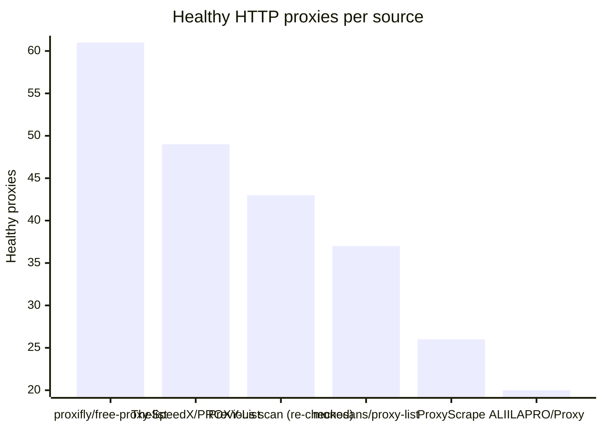

# Proxy Configs

<!-- dynamic timestamp placeholders for workflow sed script -->
channel_stats_chart.svg?v=1795370639
performance_report.html?v=1795370639

### Performance Chart

### Performance Report
[View Report](assets/performance_report.html?v=1795370639)

## HTTP

<!-- STATS:HTTP:START -->

_Last updated: 2026-11-22 12:14 UTC_

```mermaid
xychart-beta
    title "Healthy HTTP proxies per source"
    x-axis ["proxifly/free-proxy-list", "TheSpeedX/PROXY-List", "Previous scan (re-checked)", "monosans/proxy-list", "ProxyScrape", "ALIILAPRO/Proxy"]
    y-axis "Healthy proxies"
    bar [61, 49, 43, 37, 26, 20]
```

| Source | Healthy proxies |
|---|---|
| proxifly/free-proxy-list | 61 |
| TheSpeedX/PROXY-List | 49 |
| Previous scan (re-checked) | 43 |
| monosans/proxy-list | 37 |
| ProxyScrape | 26 |
| ALIILAPRO/Proxy | 20 |
| **Total unique** | **236** |

<!-- STATS:HTTP:END -->

## SOCKS5

<!-- STATS:SOCKS5:START -->

_Last updated: 2026-11-22 12:14 UTC_

```mermaid
xychart-beta
    title "Healthy SOCKS5 proxies per source"
    x-axis ["proxifly/free-proxy-list", "TheSpeedX/PROXY-List", "ProxyScrape", "Previous scan (re-checked)", "ALIILAPRO/Proxy", "monosans/proxy-list", "roosterkid/openproxylist"]
    y-axis "Healthy proxies"
    bar [86, 56, 47, 30, 22, 18, 1]
```

| Source | Healthy proxies |
|---|---|
| proxifly/free-proxy-list | 86 |
| TheSpeedX/PROXY-List | 56 |
| ProxyScrape | 47 |
| Previous scan (re-checked) | 30 |
| ALIILAPRO/Proxy | 22 |
| monosans/proxy-list | 18 |
| roosterkid/openproxylist | 1 |
| **Total unique** | **260** |

<!-- STATS:SOCKS5:END -->
