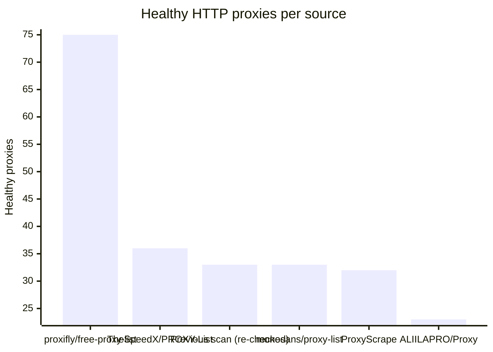
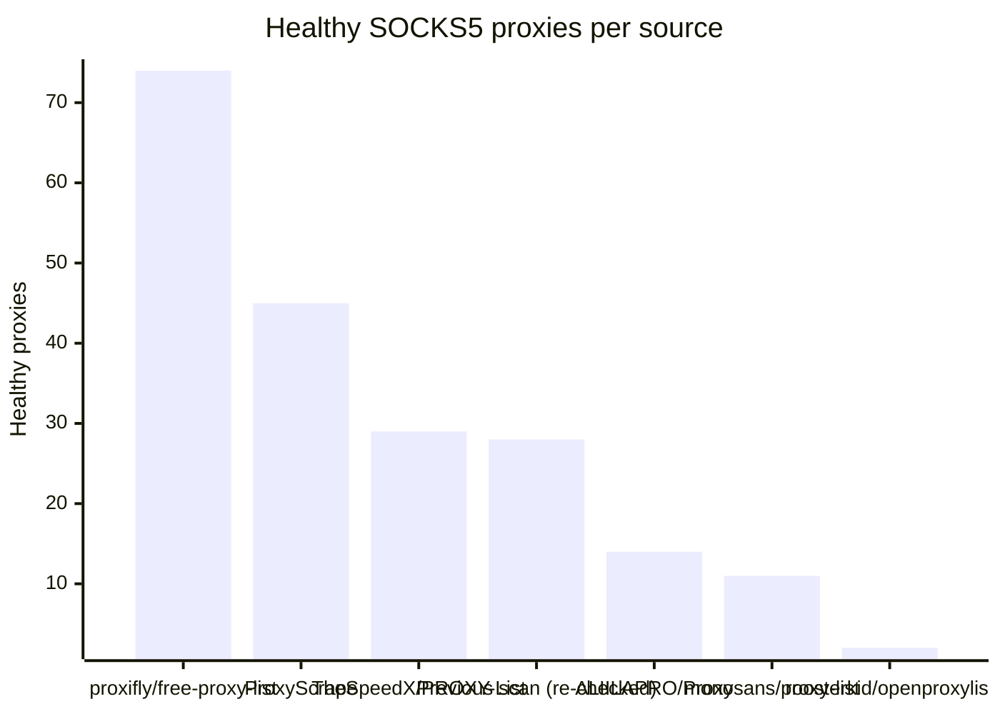

# Proxy Configs

<!-- dynamic timestamp placeholders for workflow sed script -->
channel_stats_chart.svg?v=1791309724
performance_report.html?v=1791309724

### Performance Chart

### Performance Report
[View Report](assets/performance_report.html?v=1791309724)

## HTTP

<!-- STATS:HTTP:START -->

_Last updated: 2026-11-18 00:15 UTC_

```mermaid
xychart-beta
    title "Healthy HTTP proxies per source"
    x-axis ["proxifly/free-proxy-list", "TheSpeedX/PROXY-List", "Previous scan (re-checked)", "monosans/proxy-list", "ProxyScrape", "ALIILAPRO/Proxy"]
    y-axis "Healthy proxies"
    bar [75, 36, 33, 33, 32, 23]
```

| Source | Healthy proxies |
|---|---|
| proxifly/free-proxy-list | 75 |
| TheSpeedX/PROXY-List | 36 |
| Previous scan (re-checked) | 33 |
| monosans/proxy-list | 33 |
| ProxyScrape | 32 |
| ALIILAPRO/Proxy | 23 |
| **Total unique** | **232** |

<!-- STATS:HTTP:END -->

## SOCKS5

<!-- STATS:SOCKS5:START -->

_Last updated: 2026-11-18 00:15 UTC_

```mermaid
xychart-beta
    title "Healthy SOCKS5 proxies per source"
    x-axis ["proxifly/free-proxy-list", "ProxyScrape", "TheSpeedX/PROXY-List", "Previous scan (re-checked)", "ALIILAPRO/Proxy", "monosans/proxy-list", "roosterkid/openproxylist"]
    y-axis "Healthy proxies"
    bar [74, 45, 29, 28, 14, 11, 2]
```

| Source | Healthy proxies |
|---|---|
| proxifly/free-proxy-list | 74 |
| ProxyScrape | 45 |
| TheSpeedX/PROXY-List | 29 |
| Previous scan (re-checked) | 28 |
| ALIILAPRO/Proxy | 14 |
| monosans/proxy-list | 11 |
| roosterkid/openproxylist | 2 |
| **Total unique** | **203** |

<!-- STATS:SOCKS5:END -->
