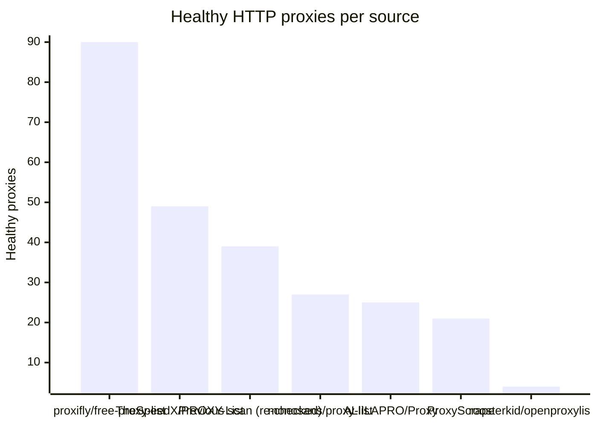
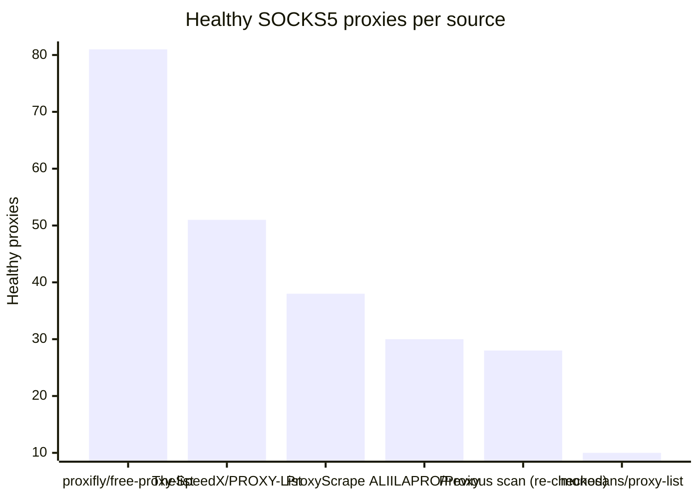

# Proxy Configs

<!-- dynamic timestamp placeholders for workflow sed script -->
channel_stats_chart.svg?v=1791309724
performance_report.html?v=1791309724

### Performance Chart

### Performance Report
[View Report](assets/performance_report.html?v=1791309724)

## HTTP

<!-- STATS:HTTP:START -->

_Last updated: 2026-11-16 06:12 UTC_

```mermaid
xychart-beta
    title "Healthy HTTP proxies per source"
    x-axis ["proxifly/free-proxy-list", "TheSpeedX/PROXY-List", "Previous scan (re-checked)", "monosans/proxy-list", "ALIILAPRO/Proxy", "ProxyScrape", "roosterkid/openproxylist"]
    y-axis "Healthy proxies"
    bar [90, 49, 39, 27, 25, 21, 4]
```

| Source | Healthy proxies |
|---|---|
| proxifly/free-proxy-list | 90 |
| TheSpeedX/PROXY-List | 49 |
| Previous scan (re-checked) | 39 |
| monosans/proxy-list | 27 |
| ALIILAPRO/Proxy | 25 |
| ProxyScrape | 21 |
| roosterkid/openproxylist | 4 |
| **Total unique** | **255** |

<!-- STATS:HTTP:END -->

## SOCKS5

<!-- STATS:SOCKS5:START -->

_Last updated: 2026-11-16 06:12 UTC_

```mermaid
xychart-beta
    title "Healthy SOCKS5 proxies per source"
    x-axis ["proxifly/free-proxy-list", "TheSpeedX/PROXY-List", "ProxyScrape", "ALIILAPRO/Proxy", "Previous scan (re-checked)", "monosans/proxy-list"]
    y-axis "Healthy proxies"
    bar [81, 51, 38, 30, 28, 10]
```

| Source | Healthy proxies |
|---|---|
| proxifly/free-proxy-list | 81 |
| TheSpeedX/PROXY-List | 51 |
| ProxyScrape | 38 |
| ALIILAPRO/Proxy | 30 |
| Previous scan (re-checked) | 28 |
| monosans/proxy-list | 10 |
| **Total unique** | **238** |

<!-- STATS:SOCKS5:END -->
