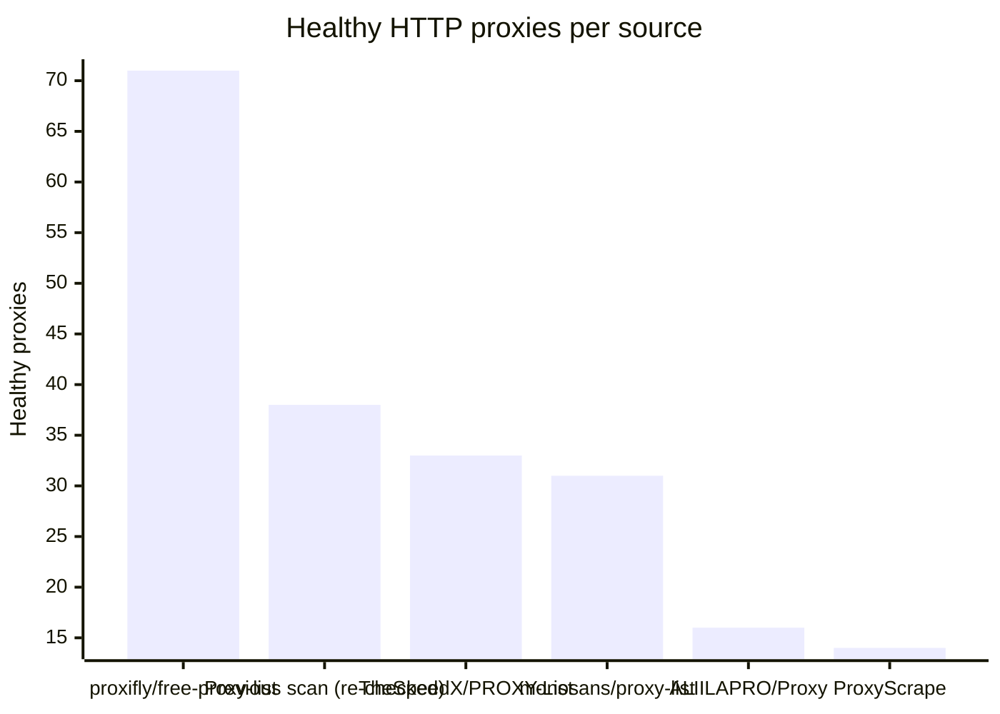
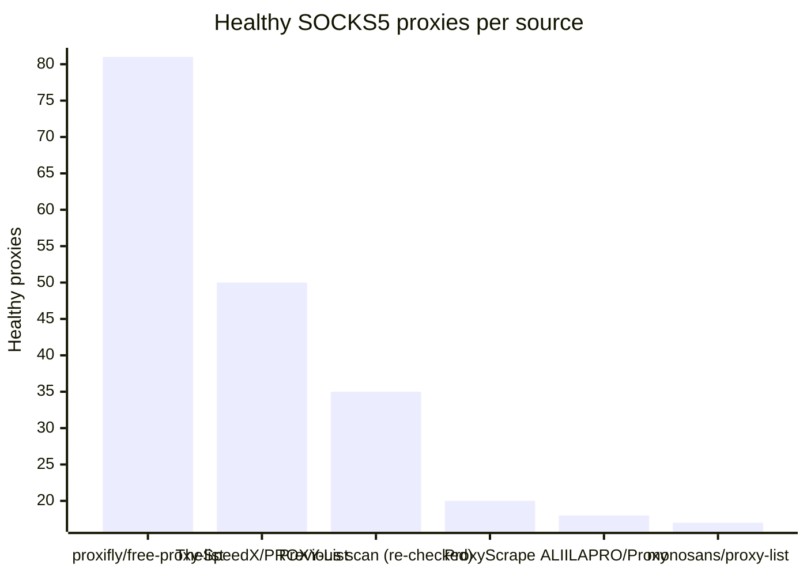

# Proxy Configs

<!-- dynamic timestamp placeholders for workflow sed script -->
channel_stats_chart.svg?v=1791309724
performance_report.html?v=1791309724

### Performance Chart

### Performance Report
[View Report](assets/performance_report.html?v=1791309724)

## HTTP

<!-- STATS:HTTP:START -->

_Last updated: 2026-11-28 12:15 UTC_

```mermaid
xychart-beta
    title "Healthy HTTP proxies per source"
    x-axis ["proxifly/free-proxy-list", "Previous scan (re-checked)", "TheSpeedX/PROXY-List", "monosans/proxy-list", "ALIILAPRO/Proxy", "ProxyScrape"]
    y-axis "Healthy proxies"
    bar [71, 38, 33, 31, 16, 14]
```

| Source | Healthy proxies |
|---|---|
| proxifly/free-proxy-list | 71 |
| Previous scan (re-checked) | 38 |
| TheSpeedX/PROXY-List | 33 |
| monosans/proxy-list | 31 |
| ALIILAPRO/Proxy | 16 |
| ProxyScrape | 14 |
| **Total unique** | **203** |

<!-- STATS:HTTP:END -->

## SOCKS5

<!-- STATS:SOCKS5:START -->

_Last updated: 2026-11-28 12:15 UTC_

```mermaid
xychart-beta
    title "Healthy SOCKS5 proxies per source"
    x-axis ["proxifly/free-proxy-list", "TheSpeedX/PROXY-List", "Previous scan (re-checked)", "ProxyScrape", "ALIILAPRO/Proxy", "monosans/proxy-list"]
    y-axis "Healthy proxies"
    bar [81, 50, 35, 20, 18, 17]
```

| Source | Healthy proxies |
|---|---|
| proxifly/free-proxy-list | 81 |
| TheSpeedX/PROXY-List | 50 |
| Previous scan (re-checked) | 35 |
| ProxyScrape | 20 |
| ALIILAPRO/Proxy | 18 |
| monosans/proxy-list | 17 |
| **Total unique** | **221** |

<!-- STATS:SOCKS5:END -->
