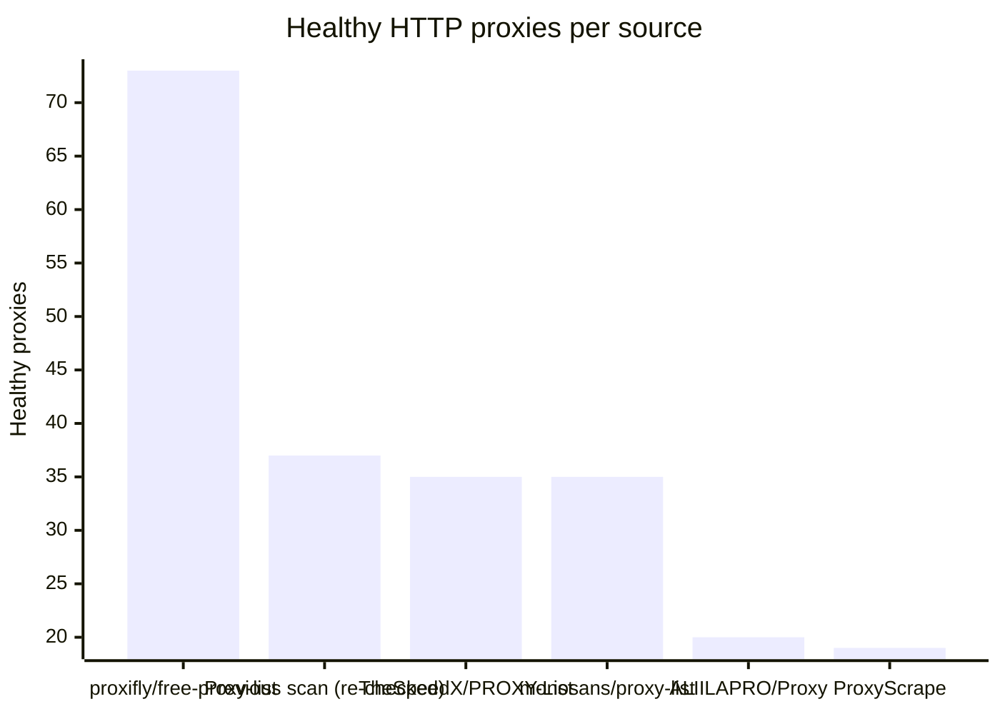
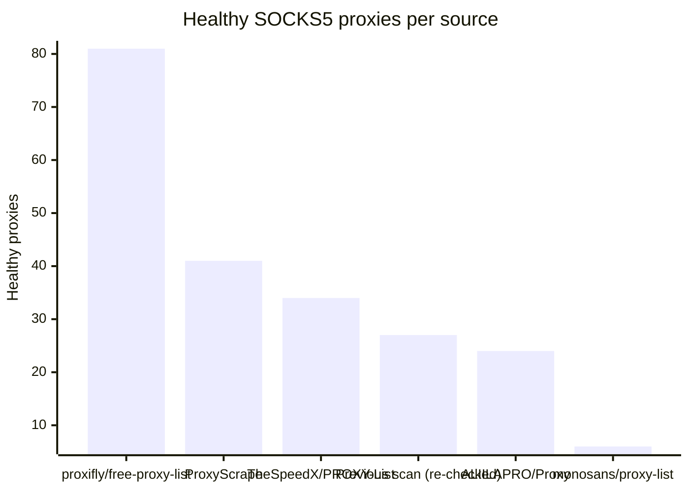

# Proxy Configs

<!-- dynamic timestamp placeholders for workflow sed script -->
channel_stats_chart.svg?v=1791309724
performance_report.html?v=1791309724

### Performance Chart

### Performance Report
[View Report](assets/performance_report.html?v=1791309724)

## HTTP

<!-- STATS:HTTP:START -->

_Last updated: 2026-11-25 12:11 UTC_

```mermaid
xychart-beta
    title "Healthy HTTP proxies per source"
    x-axis ["proxifly/free-proxy-list", "Previous scan (re-checked)", "TheSpeedX/PROXY-List", "monosans/proxy-list", "ALIILAPRO/Proxy", "ProxyScrape"]
    y-axis "Healthy proxies"
    bar [73, 37, 35, 35, 20, 19]
```

| Source | Healthy proxies |
|---|---|
| proxifly/free-proxy-list | 73 |
| Previous scan (re-checked) | 37 |
| TheSpeedX/PROXY-List | 35 |
| monosans/proxy-list | 35 |
| ALIILAPRO/Proxy | 20 |
| ProxyScrape | 19 |
| **Total unique** | **219** |

<!-- STATS:HTTP:END -->

## SOCKS5

<!-- STATS:SOCKS5:START -->

_Last updated: 2026-11-25 12:11 UTC_

```mermaid
xychart-beta
    title "Healthy SOCKS5 proxies per source"
    x-axis ["proxifly/free-proxy-list", "ProxyScrape", "TheSpeedX/PROXY-List", "Previous scan (re-checked)", "ALIILAPRO/Proxy", "monosans/proxy-list"]
    y-axis "Healthy proxies"
    bar [81, 41, 34, 27, 24, 6]
```

| Source | Healthy proxies |
|---|---|
| proxifly/free-proxy-list | 81 |
| ProxyScrape | 41 |
| TheSpeedX/PROXY-List | 34 |
| Previous scan (re-checked) | 27 |
| ALIILAPRO/Proxy | 24 |
| monosans/proxy-list | 6 |
| **Total unique** | **213** |

<!-- STATS:SOCKS5:END -->
