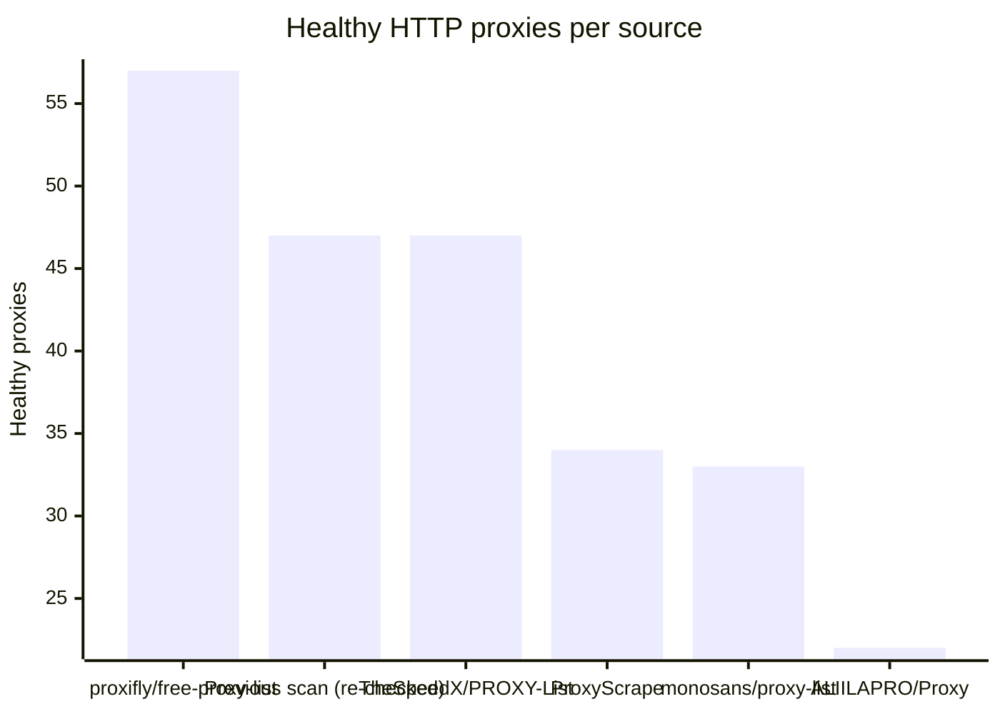
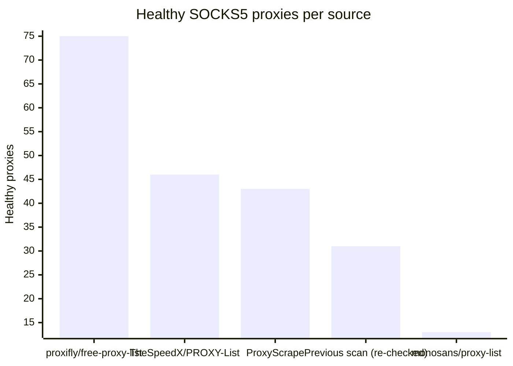

# Proxy Configs

<!-- dynamic timestamp placeholders for workflow sed script -->
channel_stats_chart.svg?v=1795586549
performance_report.html?v=1795586549

### Performance Chart

### Performance Report
[View Report](assets/performance_report.html?v=1795586549)

## HTTP

<!-- STATS:HTTP:START -->

_Last updated: 2026-11-25 00:12 UTC_

```mermaid
xychart-beta
    title "Healthy HTTP proxies per source"
    x-axis ["proxifly/free-proxy-list", "Previous scan (re-checked)", "TheSpeedX/PROXY-List", "ProxyScrape", "monosans/proxy-list", "ALIILAPRO/Proxy"]
    y-axis "Healthy proxies"
    bar [57, 47, 47, 34, 33, 22]
```

| Source | Healthy proxies |
|---|---|
| proxifly/free-proxy-list | 57 |
| Previous scan (re-checked) | 47 |
| TheSpeedX/PROXY-List | 47 |
| ProxyScrape | 34 |
| monosans/proxy-list | 33 |
| ALIILAPRO/Proxy | 22 |
| **Total unique** | **240** |

<!-- STATS:HTTP:END -->

## SOCKS5

<!-- STATS:SOCKS5:START -->

_Last updated: 2026-11-25 00:12 UTC_

```mermaid
xychart-beta
    title "Healthy SOCKS5 proxies per source"
    x-axis ["proxifly/free-proxy-list", "TheSpeedX/PROXY-List", "ProxyScrape", "Previous scan (re-checked)", "monosans/proxy-list"]
    y-axis "Healthy proxies"
    bar [75, 46, 43, 31, 13]
```

| Source | Healthy proxies |
|---|---|
| proxifly/free-proxy-list | 75 |
| TheSpeedX/PROXY-List | 46 |
| ProxyScrape | 43 |
| Previous scan (re-checked) | 31 |
| monosans/proxy-list | 13 |
| **Total unique** | **208** |

<!-- STATS:SOCKS5:END -->
