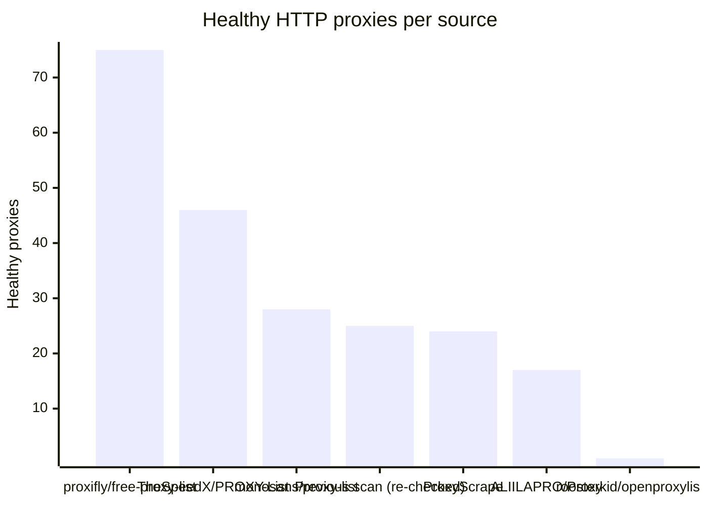
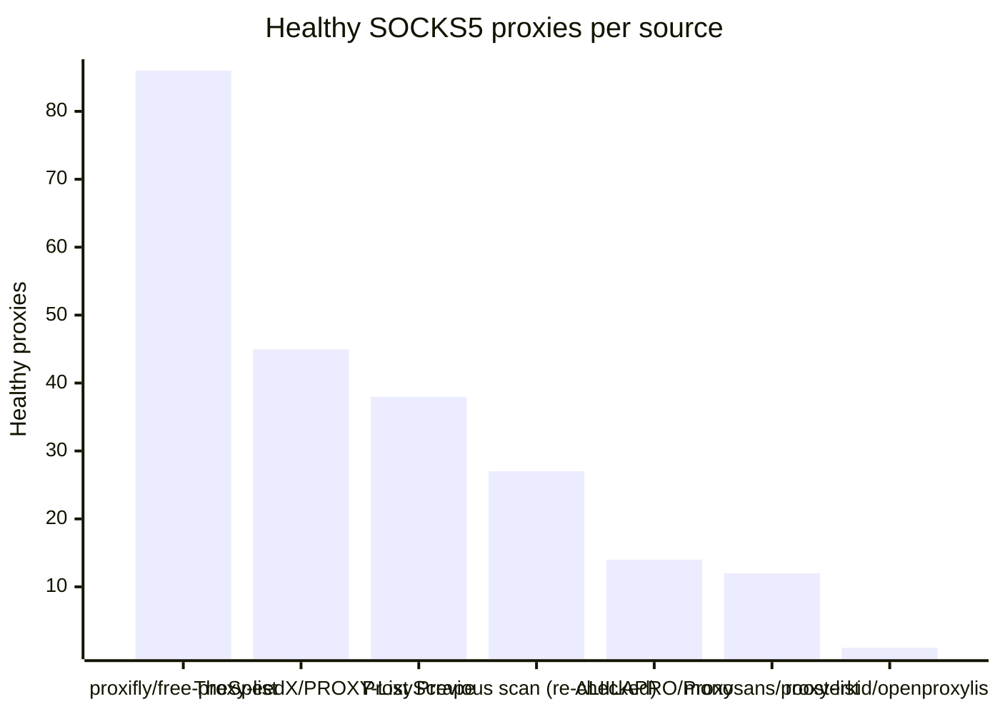

# Proxy Configs

<!-- dynamic timestamp placeholders for workflow sed script -->
channel_stats_chart.svg?v=1791309724
performance_report.html?v=1791309724

### Performance Chart

### Performance Report
[View Report](assets/performance_report.html?v=1791309724)

## HTTP

<!-- STATS:HTTP:START -->

_Last updated: 2026-11-20 12:14 UTC_

```mermaid
xychart-beta
    title "Healthy HTTP proxies per source"
    x-axis ["proxifly/free-proxy-list", "TheSpeedX/PROXY-List", "monosans/proxy-list", "Previous scan (re-checked)", "ProxyScrape", "ALIILAPRO/Proxy", "roosterkid/openproxylist"]
    y-axis "Healthy proxies"
    bar [75, 46, 28, 25, 24, 17, 1]
```

| Source | Healthy proxies |
|---|---|
| proxifly/free-proxy-list | 75 |
| TheSpeedX/PROXY-List | 46 |
| monosans/proxy-list | 28 |
| Previous scan (re-checked) | 25 |
| ProxyScrape | 24 |
| ALIILAPRO/Proxy | 17 |
| roosterkid/openproxylist | 1 |
| **Total unique** | **216** |

<!-- STATS:HTTP:END -->

## SOCKS5

<!-- STATS:SOCKS5:START -->

_Last updated: 2026-11-20 12:14 UTC_

```mermaid
xychart-beta
    title "Healthy SOCKS5 proxies per source"
    x-axis ["proxifly/free-proxy-list", "TheSpeedX/PROXY-List", "ProxyScrape", "Previous scan (re-checked)", "ALIILAPRO/Proxy", "monosans/proxy-list", "roosterkid/openproxylist"]
    y-axis "Healthy proxies"
    bar [86, 45, 38, 27, 14, 12, 1]
```

| Source | Healthy proxies |
|---|---|
| proxifly/free-proxy-list | 86 |
| TheSpeedX/PROXY-List | 45 |
| ProxyScrape | 38 |
| Previous scan (re-checked) | 27 |
| ALIILAPRO/Proxy | 14 |
| monosans/proxy-list | 12 |
| roosterkid/openproxylist | 1 |
| **Total unique** | **223** |

<!-- STATS:SOCKS5:END -->
