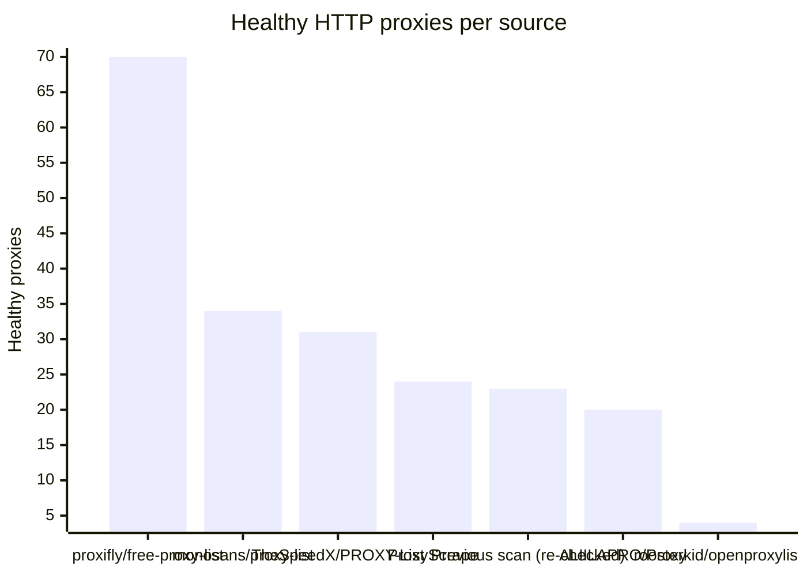
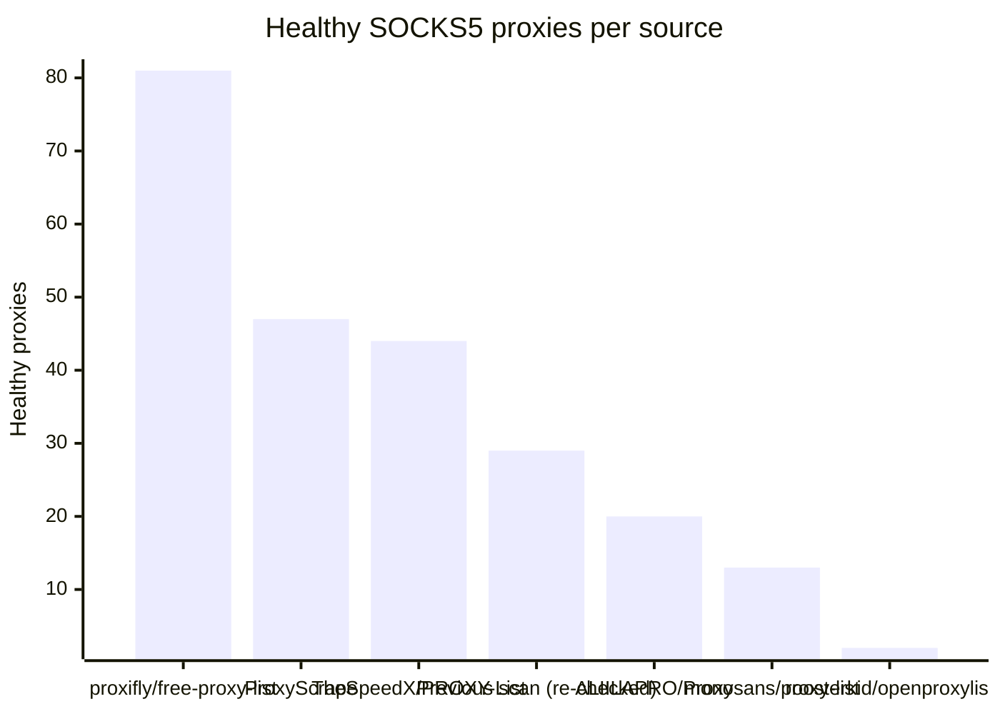

# Proxy Configs

<!-- dynamic timestamp placeholders for workflow sed script -->
channel_stats_chart.svg?v=1791309724
performance_report.html?v=1791309724

### Performance Chart

### Performance Report
[View Report](assets/performance_report.html?v=1791309724)

## HTTP

<!-- STATS:HTTP:START -->

_Last updated: 2026-11-19 06:14 UTC_

```mermaid
xychart-beta
    title "Healthy HTTP proxies per source"
    x-axis ["proxifly/free-proxy-list", "monosans/proxy-list", "TheSpeedX/PROXY-List", "ProxyScrape", "Previous scan (re-checked)", "ALIILAPRO/Proxy", "roosterkid/openproxylist"]
    y-axis "Healthy proxies"
    bar [70, 34, 31, 24, 23, 20, 4]
```

| Source | Healthy proxies |
|---|---|
| proxifly/free-proxy-list | 70 |
| monosans/proxy-list | 34 |
| TheSpeedX/PROXY-List | 31 |
| ProxyScrape | 24 |
| Previous scan (re-checked) | 23 |
| ALIILAPRO/Proxy | 20 |
| roosterkid/openproxylist | 4 |
| **Total unique** | **206** |

<!-- STATS:HTTP:END -->

## SOCKS5

<!-- STATS:SOCKS5:START -->

_Last updated: 2026-11-19 06:14 UTC_

```mermaid
xychart-beta
    title "Healthy SOCKS5 proxies per source"
    x-axis ["proxifly/free-proxy-list", "ProxyScrape", "TheSpeedX/PROXY-List", "Previous scan (re-checked)", "ALIILAPRO/Proxy", "monosans/proxy-list", "roosterkid/openproxylist"]
    y-axis "Healthy proxies"
    bar [81, 47, 44, 29, 20, 13, 2]
```

| Source | Healthy proxies |
|---|---|
| proxifly/free-proxy-list | 81 |
| ProxyScrape | 47 |
| TheSpeedX/PROXY-List | 44 |
| Previous scan (re-checked) | 29 |
| ALIILAPRO/Proxy | 20 |
| monosans/proxy-list | 13 |
| roosterkid/openproxylist | 2 |
| **Total unique** | **236** |

<!-- STATS:SOCKS5:END -->
