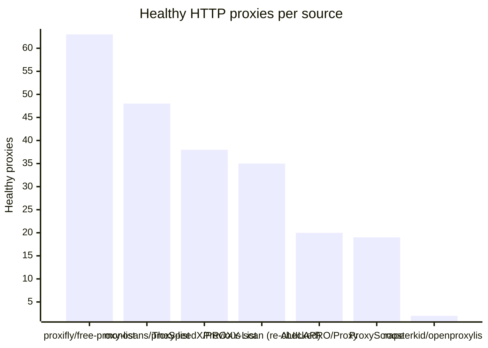
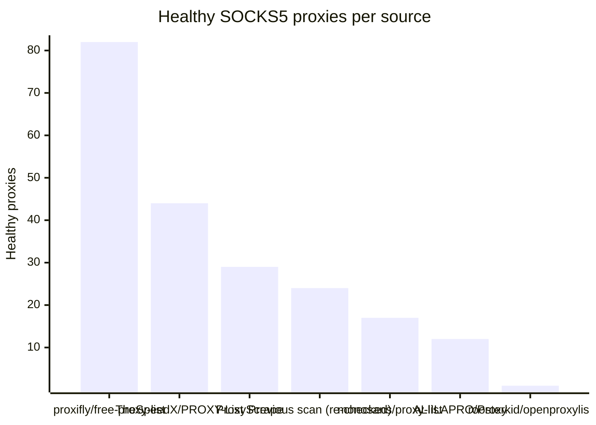

# Proxy Configs

<!-- dynamic timestamp placeholders for workflow sed script -->
channel_stats_chart.svg?v=1795651373
performance_report.html?v=1795651373

### Performance Chart

### Performance Report
[View Report](assets/performance_report.html?v=1795651373)

## HTTP

<!-- STATS:HTTP:START -->

_Last updated: 2026-11-25 18:13 UTC_

```mermaid
xychart-beta
    title "Healthy HTTP proxies per source"
    x-axis ["proxifly/free-proxy-list", "monosans/proxy-list", "TheSpeedX/PROXY-List", "Previous scan (re-checked)", "ALIILAPRO/Proxy", "ProxyScrape", "roosterkid/openproxylist"]
    y-axis "Healthy proxies"
    bar [63, 48, 38, 35, 20, 19, 2]
```

| Source | Healthy proxies |
|---|---|
| proxifly/free-proxy-list | 63 |
| monosans/proxy-list | 48 |
| TheSpeedX/PROXY-List | 38 |
| Previous scan (re-checked) | 35 |
| ALIILAPRO/Proxy | 20 |
| ProxyScrape | 19 |
| roosterkid/openproxylist | 2 |
| **Total unique** | **225** |

<!-- STATS:HTTP:END -->

## SOCKS5

<!-- STATS:SOCKS5:START -->

_Last updated: 2026-11-25 18:13 UTC_

```mermaid
xychart-beta
    title "Healthy SOCKS5 proxies per source"
    x-axis ["proxifly/free-proxy-list", "TheSpeedX/PROXY-List", "ProxyScrape", "Previous scan (re-checked)", "monosans/proxy-list", "ALIILAPRO/Proxy", "roosterkid/openproxylist"]
    y-axis "Healthy proxies"
    bar [82, 44, 29, 24, 17, 12, 1]
```

| Source | Healthy proxies |
|---|---|
| proxifly/free-proxy-list | 82 |
| TheSpeedX/PROXY-List | 44 |
| ProxyScrape | 29 |
| Previous scan (re-checked) | 24 |
| monosans/proxy-list | 17 |
| ALIILAPRO/Proxy | 12 |
| roosterkid/openproxylist | 1 |
| **Total unique** | **209** |

<!-- STATS:SOCKS5:END -->
