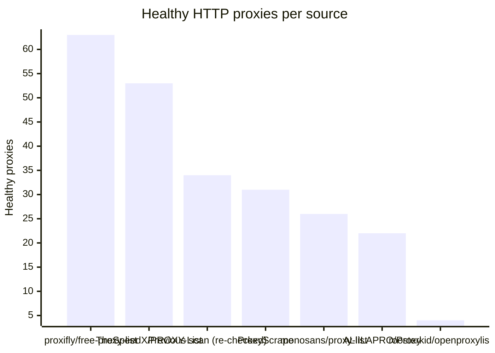
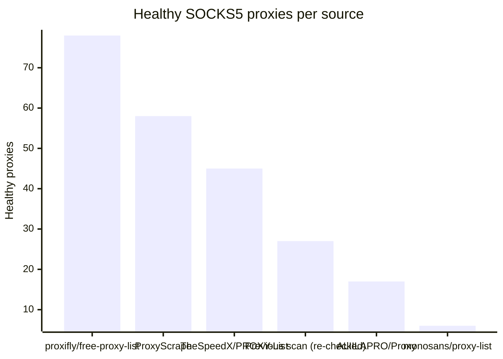

# Proxy Configs

<!-- dynamic timestamp placeholders for workflow sed script -->
channel_stats_chart.svg?v=1791309724
performance_report.html?v=1791309724

### Performance Chart

### Performance Report
[View Report](assets/performance_report.html?v=1791309724)

## HTTP

<!-- STATS:HTTP:START -->

_Last updated: 2026-11-21 06:17 UTC_

```mermaid
xychart-beta
    title "Healthy HTTP proxies per source"
    x-axis ["proxifly/free-proxy-list", "TheSpeedX/PROXY-List", "Previous scan (re-checked)", "ProxyScrape", "monosans/proxy-list", "ALIILAPRO/Proxy", "roosterkid/openproxylist"]
    y-axis "Healthy proxies"
    bar [63, 53, 34, 31, 26, 22, 4]
```

| Source | Healthy proxies |
|---|---|
| proxifly/free-proxy-list | 63 |
| TheSpeedX/PROXY-List | 53 |
| Previous scan (re-checked) | 34 |
| ProxyScrape | 31 |
| monosans/proxy-list | 26 |
| ALIILAPRO/Proxy | 22 |
| roosterkid/openproxylist | 4 |
| **Total unique** | **233** |

<!-- STATS:HTTP:END -->

## SOCKS5

<!-- STATS:SOCKS5:START -->

_Last updated: 2026-11-21 06:17 UTC_

```mermaid
xychart-beta
    title "Healthy SOCKS5 proxies per source"
    x-axis ["proxifly/free-proxy-list", "ProxyScrape", "TheSpeedX/PROXY-List", "Previous scan (re-checked)", "ALIILAPRO/Proxy", "monosans/proxy-list"]
    y-axis "Healthy proxies"
    bar [78, 58, 45, 27, 17, 6]
```

| Source | Healthy proxies |
|---|---|
| proxifly/free-proxy-list | 78 |
| ProxyScrape | 58 |
| TheSpeedX/PROXY-List | 45 |
| Previous scan (re-checked) | 27 |
| ALIILAPRO/Proxy | 17 |
| monosans/proxy-list | 6 |
| **Total unique** | **231** |

<!-- STATS:SOCKS5:END -->
