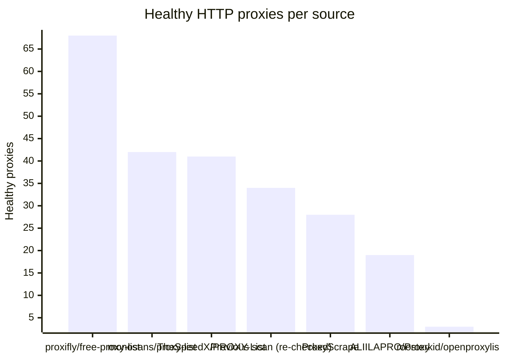
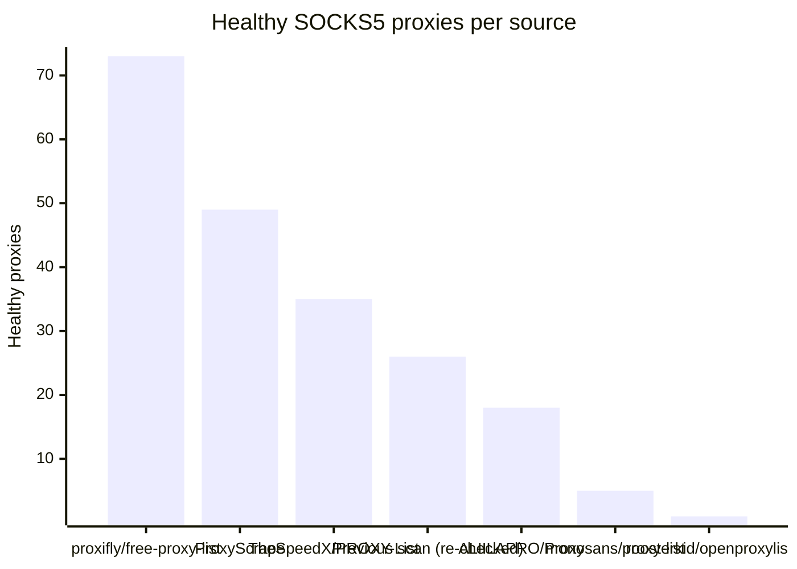

# Proxy Configs

<!-- dynamic timestamp placeholders for workflow sed script -->
channel_stats_chart.svg?v=1791309724
performance_report.html?v=1791309724

### Performance Chart

### Performance Report
[View Report](assets/performance_report.html?v=1791309724)

## HTTP

<!-- STATS:HTTP:START -->

_Last updated: 2026-11-20 00:14 UTC_

```mermaid
xychart-beta
    title "Healthy HTTP proxies per source"
    x-axis ["proxifly/free-proxy-list", "monosans/proxy-list", "TheSpeedX/PROXY-List", "Previous scan (re-checked)", "ProxyScrape", "ALIILAPRO/Proxy", "roosterkid/openproxylist"]
    y-axis "Healthy proxies"
    bar [68, 42, 41, 34, 28, 19, 3]
```

| Source | Healthy proxies |
|---|---|
| proxifly/free-proxy-list | 68 |
| monosans/proxy-list | 42 |
| TheSpeedX/PROXY-List | 41 |
| Previous scan (re-checked) | 34 |
| ProxyScrape | 28 |
| ALIILAPRO/Proxy | 19 |
| roosterkid/openproxylist | 3 |
| **Total unique** | **235** |

<!-- STATS:HTTP:END -->

## SOCKS5

<!-- STATS:SOCKS5:START -->

_Last updated: 2026-11-20 00:14 UTC_

```mermaid
xychart-beta
    title "Healthy SOCKS5 proxies per source"
    x-axis ["proxifly/free-proxy-list", "ProxyScrape", "TheSpeedX/PROXY-List", "Previous scan (re-checked)", "ALIILAPRO/Proxy", "monosans/proxy-list", "roosterkid/openproxylist"]
    y-axis "Healthy proxies"
    bar [73, 49, 35, 26, 18, 5, 1]
```

| Source | Healthy proxies |
|---|---|
| proxifly/free-proxy-list | 73 |
| ProxyScrape | 49 |
| TheSpeedX/PROXY-List | 35 |
| Previous scan (re-checked) | 26 |
| ALIILAPRO/Proxy | 18 |
| monosans/proxy-list | 5 |
| roosterkid/openproxylist | 1 |
| **Total unique** | **207** |

<!-- STATS:SOCKS5:END -->
